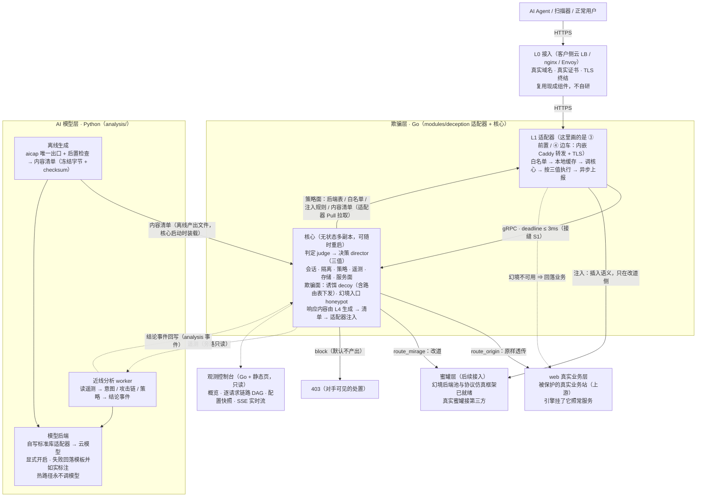

# Shen —— 面向自主渗透 Agent 的欺骗引擎

> 当前工作名。

## 1. 它做什么

**不拦截可疑流量，而是把已识别的自动化对手透明地送进幻境后端** —— 让它以为自己在打真站。
真实用户与真实业务**完全不受影响**：引擎故障、超时、未识别状态**一律放行**到真实业务，幻境后端挂了**回落**业务。

**形态：一个独立服务 + 接入物料。** 不是 SDK、不是业务中间件，不要求客户改一行业务代码。
四种接入形态：**① 旁路镜像**（唯一不在请求路径上，只观察）· **② DNS 引流**（纯配置）· **③ 反向代理前置** · **④ Sidecar**。



**三条设计底线**：

1. **不影响原始业务** —— 故障 / 超时 / 未识别**一律放行**；幻境不可用**回落**业务；
2. **决策只有三值** —— `route_origin` / `route_mirage` / `block`，**禁止**第四值；加重走 `severity` 旁路字段，**禁止**弹挑战页；
3. **判定只实现一次** —— 判定与响应生成只在核心，边缘适配器**只执行、不判定**。

**使用边界**（务必先读）：

| 项 | 说明 |
| --- | --- |
| **仅限授权环境** | **仅限**你拥有或已获书面授权的站点与环境使用 |
| **不做控制面** | **禁止**实现 C2、载荷投递、木马、向第三方 Agent 下发指令；引擎是被动组件，不主动连接目标 |
| **只用自己的素材** | 幻境内容**必须**基于自有素材或已获授权的站点；**禁止**伪造第三方品牌 |
| **对外可见面不得自曝** | 攻击者可见的任何位置**禁止**出现「蜜罐 / decoy / mirage / 决策分数」等字样（有自动检查兜底） |

## 2. 现在能做什么、还没接什么

| 阶段 | 内容 | 状态 |
| --- | --- | --- |
| **1 · MVP（只观察）** | 判定 · 会话 · 遥测 · 存储 · 旁路镜像接收端 · 服务面 | ✅ 完成 |
| **2a · 接管与引流** | 策略装载 · 决策（阈值 → 三值 + 灰度）· 反向代理前置 + 边车 · DNS 引流模板 | ✅ 完成 |
| **2b · 处置内容** | 诱饵面 · 幻境后端池 · 响应生成 · 隔离 · 边缘注入 · AI 欺骗内容 | 🟡 模块已实现并单测；**幻境后端池 / 白名单 / 响应改写规则 / AI 内容清单已能经策略面下发到边缘**（端到端实测：改道 + 注入）。**诱饵资产到边缘的通路已通**（核心投影诱饵路由表 → 适配器按**路径段边界 + 归一化**投递到幻境后端，`executed=decoy`；**故障不回生产**，影子模式下不投递）；**远端撤销优先于本地兜底**（远端禁用某后端后，本地同名项不再复活它） |
| **判定与观测** | 判定字段：UA · 方法 · 路径 · **归一化路径** · 查询串（**反复解码到不动点**，另存**原样字节**供审计） · 来源 IP · TLS 指纹；路径规则支持**路径段边界**匹配（`/.git` 不再误伤 `/.gitignore`） | ✅ 已实现。逐判定事件带**会话面具**（整段 Cookie 不跨接缝，只送按约定 cookie 名取出的**最小身份**）；L4 近线结论**按会话分组**、**按游标增量读取**（不再每轮重读整个窗口），丢窗口可见 |
| **3 · 高交互与智能** | 协议仿真蜜罐 · 蜜网 · LLM 会话 · 意图与攻击链 | 🟡 **蜜罐到此为止只做了「接入架构」**：协议注册表 · 运行框架（并发上限 / 对称回收）· 会话录制契约已就绪；**具体蜜罐接第三方、协议栈待专项调研**；其余模块未开始 |

## 3. 运行

### 3.1 一键起全套（推荐 —— 本机只需要 Docker）

```sh
make start          # = scripts/shen.sh up；会自动等就绪并打印地址
```

启动后：

| 地址 | 是什么 |
| --- | --- |
| http://127.0.0.1:19444/ | **观测控制台** —— 概览（含观测新鲜度）· 配置 · 逐请求链路 · 告警 · 逐判定日志 · L4 分析结论 · 原始事件 |
| http://127.0.0.1:18080/ | **业务入口**（经引擎；默认影子模式：只观测、不处置） |

```sh
curl -s -A "HeadlessChrome/120" http://127.0.0.1:18080/.git/config   # 探针：控制台应显示高分与命中信号
curl -s -A "Mozilla/5.0"        http://127.0.0.1:18080/               # 正常浏览器：应为低分
```

其它：`make docker-ps`（状态）· `make docker-log S=core`（日志尾部 50 行）· `make down`（停掉）·
宿主端口被占用时 `SHEN_HTTP_PORT=8080 SHEN_CONSOLE_PORT=9444 make start`。

#### 合成 Web 管理台 + 诱饵路由（**验证档**，不是默认启动项）

默认 `make start` 只起基础栈（核心 / 代理 / 控制台 / 演示业务），**不含** Web 诱饵后端。
要验证「诱饵路由 → 真实合成后端」这条链，用**双文件**起验证档：

```sh
docker compose -f deploy/docker/compose.yaml -f deploy/docker/compose.verify-mirage.yaml up -d --force-recreate
curl -s http://127.0.0.1:18080/admin/login        # 合成登录页（Atlas 控制台）
curl -s -c /tmp/jar -d 'username=x&password=y' http://127.0.0.1:18080/admin/login
curl -s -b /tmp/jar http://127.0.0.1:18080/admin/api/users?page=1   # 需带 cookie 的合成 JSON
docker compose -f deploy/docker/compose.yaml -f deploy/docker/compose.verify-mirage.yaml down
```

三条要注意的事（§7.1 的 `W1`/`W7`）：

1. **登录输入只用合成值**：本后端没有账号体系、**从不校验凭据**，不要输入任何真实凭证。
2. **`/admin` 是路径归属**：真实站点本来就有 `/admin` 时，验证档的配置会把它接走 ——
   归属声明 `decoys.assets[].hosts` 就是为此存在的（**启用中的资产必须声明主机名**）；
   套用到真实站点前先确认「这个路径确实归我们」。
3. **撤销不等于立刻还给业务**：路由从策略里移除后，边缘在**搜索碑租约**内（默认 24h）仍以固定 502
   结束那些路径（不回生产）—— 这是为了避免旧链接突然打到真实站点。

**受限写路径**（`C06`）：合成管理台支持两类写动作（改账号启用状态 / 改配置项取值），
浏览器表单与 JSON API 共用同一套状态机。状态**按会话隔离**：同会话写后立刻可见（列表与审计页一致），
另一个会话看到的是原始值；写操作幂等（值没变不记账）、可选 CAS（版本不符 409、可重试不双写）、
有配额（每会话写 ≤200 次、审计 ≤200 条）。**只改内存里的合成对象**——不执行真实命令/SQL、不出站、不落盘。

```sh
curl -s -c /tmp/jar -d 'username=x&password=y' http://127.0.0.1:18080/admin/login
curl -s -b /tmp/jar -H 'Content-Type: application/json' \
  -d '{"enabled":false}' http://127.0.0.1:18080/admin/api/users/u-1001   # 受限写
curl -s -b /tmp/jar 'http://127.0.0.1:18080/admin/api/audit?page=1'      # 审计里出现这次变更（写后读）
```

> 诱饵路由与普通评分改道的**失败语义不同**：专属路由故障 ⇒ 固定 502 且**绝不回源**；
> 普通 `route_mirage` 失败仍会**回落业务**（`NI-1`）。看单条请求的 `executed` / `delivery_result` 区分。
> Web 的合成交互事件目前**只进日志**（尚未接入核心遥测）。

### 3.2 本地开发（Go / Python 直接跑）

前置：**Go 1.26+**；跑 L4 与门禁另需 **Python 3.13+**（环境建在 `analysis/.venv`）。无外部服务依赖 —— 存储用内存实现。

```sh
make tools      # 首次：把门禁工具装到 scripts/bin/（离线可重复）
make pyenv      # 首次：建 analysis/.venv 并装锁定依赖
```

依赖已 **vendor 入库**（`vendor/`），Go 侧构建与门禁**不需要网络**。

**跑起核心**（默认影子模式：只算判定、不处置）：

```sh
make run                                        # 监听 127.0.0.1:9443
make smoke                                      # 另开一个终端：对判定面发三个样本
SHEN_CORE_ADDR=127.0.0.1:9443 make analysis      # 跑一轮 L4（结论进控制台「分析结论」块）
SHEN_PROXY_UPSTREAM=http://127.0.0.1:9000 \
  go run ./modules/deception/proxy/cmd/proxy                 # 起反向代理前置（③），业务地址指向真实服务
```

### 3.3 测试与门禁

```sh
make check            # 快速内循环：构建 + 格式化 + vet + 架构 + 泄漏
make gate             # 一轮的验收命令：静态检查 + 架构 + 泄漏 + 许可审计 + 全部单测（含 -race）
make dev              # 一键开发验证：配置干跑 → 起核心 → 在线冒烟 → 规则回放 → L4 近线分析
make verify-modules   # 逐模块证据：每个模块的测试目标与实际用例数（约 30s）
make traffic          # 伪造流量：发场景并从观测面核对判定（需先起栈）
make ai-check         # AI 欺骗内容注入端到端（模板生成器，不需要模型密钥）
make pygen            # 生成 L4 的 Python gRPC 桩（契约唯一事实源是 common/api/ 下的 .proto）
```

看全部命令：`make help`。**不绿不算完成** —— 门禁失败时不得注释、跳过或绕过检查。

> 门禁里的**架构 / 追溯 / 逐模块证据**三类检查需要本项目的设计文档（一模块一文件、规则 ID 体系），
> 那部分文档与仓库代码分开发布：**本机存在时照常全跑**；**不存在时这三类检查会跳过并打印一行说明**（不静默、不算通过）。
> 受影响的命令：`make archcheck` · `make trace` · `make leakcheck` · `make verify-evidence` · `make verify-modules`。
