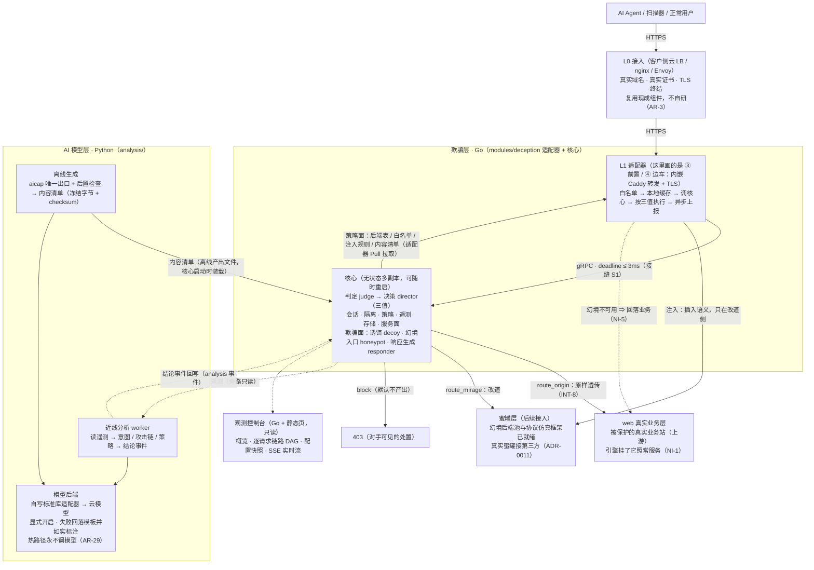

# Shen —— 面向自主渗透 Agent 的欺骗引擎

> **项目名未定**（[ADR-0004](docs/background/decisions/0004-terminology.md)）：`Shen` 只是当前工作名。

## 1. 它做什么

**不拦截可疑流量，而是把已识别的自动化对手透明地送进幻境后端** —— 让它以为自己在打真站。
真实用户与真实业务**完全不受影响**，这是最高优先级的硬约束（`NI-1`）：引擎故障、超时、未识别状态**一律放行**到真实业务，幻境后端挂了**回落**业务（`NI-5`）。

**形态：一个独立服务 + 接入物料。** 不是 SDK、不是业务中间件，不要求客户改一行业务代码（`INT-7` / `INT-9` / `INT-10`）。
四种接入形态：**① 旁路镜像**（唯一不在请求路径上，只观察）· **② DNS 引流**（纯配置）· **③ 反向代理前置** · **④ Sidecar**。



**三条不可妥协**：**不影响原始业务**（`NI-1`：故障 / 超时 / 未识别**一律放行**）· **决策只有三值**（`MD-12`：`route_origin` / `route_mirage` / `block`，**禁止**第四值，加重走 `severity` 旁路字段，**禁止**弹挑战页）· **判定只实现一次**（`AR-2` / `AR-5`：适配器**禁止**实现任何判定逻辑）。

**使用边界**（务必先读）：

| 项 | 说明 |
| --- | --- |
| **仅限授权环境** | **仅限**你拥有或已获书面授权的站点与环境（`SB-7`） |
| **不做控制面** | **禁止**实现 C2、载荷投递、木马、向第三方 Agent 下发指令（`SB-1` / `SB-2`）；引擎是被动组件，不主动连接目标（`SB-6`） |
| **只用自己的素材** | 幻境内容**必须**基于自有素材或已获授权的站点；**禁止**伪造第三方品牌（`SB-3` / `SB-4`） |
| **对外可见面不得自曝** | 攻击者可见的任何位置**禁止**出现「蜜罐 / decoy / mirage / 决策分数」等字样（`OH-1`…`OH-5`，有自动检查兜底） |

## 2. 现在能做什么、还没接什么

| 阶段 | 内容 | 状态 |
| --- | --- | --- |
| **1 · MVP（只观察）** | 判定 · 会话 · 遥测 · 存储 · 旁路镜像接收端 · 服务面 | ✅ 完成 |
| **2a · 接管与引流** | 策略装载 · 决策（阈值 → 三值 + 灰度）· 反向代理前置 + 边车 · DNS 引流模板 | ✅ 完成 |
| **2b · 处置内容** | 诱饵面 · 幻境后端池 · 响应生成 · 隔离 · 边缘注入 · AI 欺骗内容 | 🟡 模块已实现并单测；**幻境后端池 / 白名单 / 响应改写规则 / AI 内容清单已能经策略面下发到边缘**（端到端实测：改道 + 注入）。**诱饵资产到边缘的通路未通** |
| **3 · 高交互与智能** | 协议仿真蜜罐 · 蜜网 · LLM 会话 · 意图与攻击链 | 🟡 **蜜罐到此为止只做了「接入架构」**（用户裁定）：协议注册表 · 运行框架（并发上限 / 对称回收）· 会话录制契约已就绪；**具体蜜罐接第三方、协议栈待专项调研**；其余模块未开始 |

> 详细进度与逐模块状态：[`docs/progress.md`](docs/progress.md) · 已知限制与未决项：各模块文档的「未决项」段 · [`docs/background/notes/pending-experiments.md`](docs/background/notes/pending-experiments.md)。
> 本项目自身尚未声明 LICENSE（属产品决策）；依赖许可台账见 [`docs/spec/dependencies.md`](docs/spec/dependencies.md)。

## 3. 项目启动

### 3.1 一键起全套（推荐 —— 本机只需要 Docker）

```sh
scripts/shen.sh up      # 等价于 make up；会自动等就绪并打印地址
# 或者： make start
```

启动后：

| 地址 | 是什么 |
| --- | --- |
| http://127.0.0.1:19444/ | **观测控制台** —— 概览（含观测新鲜度）· 配置 · 逐请求链路 · 告警 · 逐判定日志 · L4 分析结论 · 原始事件 |
| http://127.0.0.1:18080/ | **业务入口**（经引擎；默认影子模式：只观测、不处置，`INT-11`） |

```sh
curl -s -A "HeadlessChrome/120" http://127.0.0.1:18080/.git/config   # 探针：控制台应显示高分与命中信号
curl -s -A "Mozilla/5.0"        http://127.0.0.1:18080/               # 正常浏览器：应为低分
```

其它命令：`make docker-ps`（状态）· `make docker-log S=core`（日志尾部 50 行，不跟随）· `make down`（停掉）。
宿主端口被占用时：`SHEN_HTTP_PORT=8080 SHEN_CONSOLE_PORT=9444 make up`。
排障与完整运行说明：[`docs/ops/runbook.md`](docs/ops/runbook.md) · 容器细节：[`deploy/docker/README.md`](deploy/docker/README.md)。

### 3.2 本地开发（Go / Python 直接跑）

前置：**Go 1.26+**；开发 L4 与跑门禁另需 **Python 3.13+**（环境建在 `analysis/.venv`）。无外部服务依赖 —— 存储用内存实现。

```sh
make check      # 快速内循环：构建 + 格式化 + vet + 架构 + 追溯 + 泄漏
make tools      # 首次：把门禁工具装到 scripts/bin/（离线可重复）
make pyenv      # 首次：建 analysis/.venv 并装锁定依赖
make gate       # 一轮的验收命令：静态检查 + 架构 + 追溯 + 泄漏 + 许可审计 + 全部单测（含 -race）
make dev        # 一键开发验证：配置干跑 → 起核心 → 在线冒烟 → 规则回放 → L4 近线分析
```

看全部命令：`make help`。依赖已 **vendor 入库**（`vendor/`），Go 侧构建与门禁**不需要网络**。

**跑起核心**（默认影子模式：只算判定、不处置 —— `INT-11` 要求首次上线必须如此）：

```sh
make run                                        # 监听 127.0.0.1:9443
make smoke                                      # 另开一个终端：对判定面发三个样本
SHEN_CORE_ADDR=127.0.0.1:9443 make analysis      # 跑一轮 L4（结论进控制台「分析结论」块）
SHEN_PROXY_UPSTREAM=http://127.0.0.1:9000 \
  go run ./modules/deception/proxy/cmd/proxy                 # 起反向代理前置（③），业务地址指向真实服务
```

---

**文档入口**：[`docs/README.md`](docs/README.md)（导航中枢，从这里去哪都有）· 开发规范：[`AGENTS.md`](AGENTS.md)。
