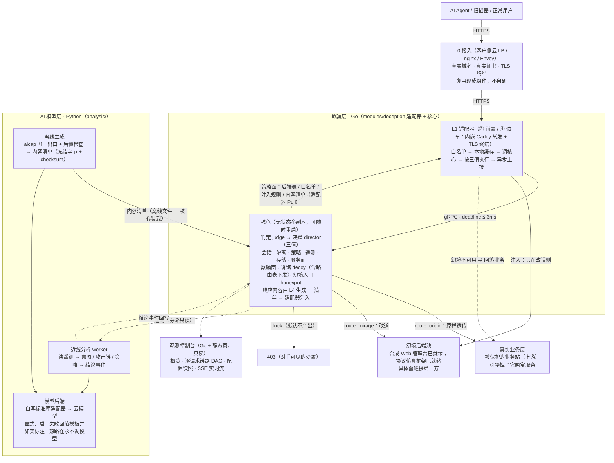

<div align="center">


# 蜃楼 · Shen

**AI 欺骗引擎** —— 面向自主渗透 Agent 的透明误导与取证平台

<sub>Mirage for machines: lure automated adversaries into synthetic worlds — without touching real business.</sub>

[](LICENSE)
[](go.mod)
[](analysis/pyproject.toml)
[-2FD4C6.svg)](#3-模块与职责)
[](#4-工程化能力)

</div>

> **名字**：蜃楼（shèn lóu）—— 海面上出现的城郭幻影。引擎的全部工作就是造一座**只对机器开放**的蜃楼：
> 真实用户与真实业务走在原地，自动化对手被透明地引进去。
> **仓库名与工作名沿用「Shen」**；产品名的正式登记在设计文档的命名 ADR 里（与仓库分开发布）。

---

## 1. 它是什么

**它不拦截可疑流量，而是把已识别的自动化对手透明地送进幻境（mirage）。**
对手以为自己在打真站，于是把工具、意图与攻击链暴露在**受控的合成世界**里。
真实用户与真实业务**完全不受影响**。

> **术语**：**幻境**（mirage）= 合成环境 · **诱饵**（decoy）= 投放在幻境侧的素材与路径 ·
> **三值决策** = `route_origin` / `route_mirage` / `block`（见 §2）。

**形态：一个独立服务 + 接入物料。** 不是 SDK，不是业务中间件，**不要求客户改一行业务代码**。
四种接入形态：**① 旁路镜像**（唯一不在请求路径上，只观察）· **② DNS 引流**（纯配置）·
**③ 反向代理前置** · **④ Sidecar**（③④ 是同一份实现的两个部署位置）。

### 三条设计底线（不可协商）

| # | 底线 | 兑现方式 |
| --- | --- | --- |
| 1 | **不影响原始业务** | 引擎故障 / 超时 / **任何未识别状态**一律放行到真实业务；幻境后端不可用**回落**业务；专属诱饵路由故障**固定 502、绝不回源** |
| 2 | **决策只有三值** | `route_origin` / `route_mirage` / `block`，**禁止**第四值；加重用 `severity` 旁路字段；**禁止**弹挑战页（那是 WAF 的形态，不是欺骗） |
| 3 | **判定只实现一次** | 判定与响应生成**只在核心**；边缘适配器**只执行、不判定**（`make archcheck` 强制） |

### 使用边界（动手前先读）

| 项 | 说明 |
| --- | --- |
| **仅限授权环境** | **仅限**你拥有或已获书面授权的站点与环境使用 |
| **不做控制面** | **禁止**实现 C2、载荷投递、木马、向第三方 Agent 下发指令；引擎是**被动组件**，不主动连接目标 |
| **只用自己的素材** | 幻境内容**必须**基于自有素材或已获授权的站点；**禁止**伪造第三方品牌 |
| **对外可见面零自曝** | 攻击者可见的任何位置**禁止**出现「蜜罐 / decoy / mirage / 决策分数」等字样 —— 有 `make leakcheck` 自动兜底 |

---

## 2. 工作原理

### 2.1 三值与「落点」分离

判定给出**意图**（三值之一）；适配器上报**实际落点**（`executed`）与**投递结果**（`delivery_result`）。
「判成什么」与「实际走了哪」**分开记录** —— 这样图上与审计里都能复核：

| 意图 | 实际落点（`executed`） | 失败时的行为 |
| --- | --- | --- |
| `route_mirage`（评分改道） | `mirage` / `origin_fallback` | 幻境不可用 ⇒ **回落业务** |
| 专属诱饵路由（路径归属） | `decoy`（+ `delivery_result`） | 后端不可用/不健康/已撤销 ⇒ **固定 502，绝不回源** |
| `route_origin` | `origin` / `whitelist` / `cache` / `failopen` | —— |
| `block`（默认不产出） | `block`（403） | —— |

### 2.2 端到端链路

```text
客户端 → L0 接入（客户侧 LB/nginx：真实域名与证书）→ L1 适配器
   ① 会话身份（最小身份值，整段 Cookie 不跨接缝）
   ② 专属诱饵路由（Host + 归一化路径 + 段边界，命中即投递）
   ③ 白名单（本地与策略面取并集）
   ④ 本地判定缓存（键含方法/路径/查询串/UA/Host/策略版本）
   ⑤ 调核心判定（gRPC，预算 ≤ 3ms；失败即放行）
   ⑥ 按三值执行（透传 / 改道 / 403）
   ⑦ 异步上报（有界队列 + 丢弃计数）
        ↓ 遥测
   核心：observer → judge（风险分）→ director（三值 + 灰度）→ 路由
        ↑ 策略面      边缘 Pull：后端表 · 白名单 · 注入规则 · 内容清单（+ 回执对账）
   L4（Python）：离线生成内容（唯一护栏出口）· 近线分析（意图/攻击链/策略，按会话分组、按游标增量）
   合成后端：Web 管理台场景包（登录 → 演示会话 → 总览/用户/配置/审计 + JSON API + 受限写）
   观测面：只读控制台（概览 · 逐请求链路 DAG · 配置 · 告警 · 原始事件 · 分析结论）
```

<details>
<summary>架构图（点击展开）</summary>



</details>

---

## 3. 模块与职责

> **清单来源**：设计文档的模块表（一模块一文件：职责 · 契约 · 规则 · 测试 · 未决项）。
> `make verify-modules` 逐个模块跑它的测试目标并核对「文档 ↔ 规则 ↔ 测试 ↔ 功能场景」是否齐备 ——
> 当前 **24 个模块全部通过**（其中 `adapter-dns` / `netpolicy` 声明为无源码、`honeypot-shell` 待建，工具会**打印豁免原因**而非静默跳过）。
> 设计文档与仓库代码**分开发布**；本机未携带时相关检查会跳过并打印一行说明。

### 核心（Go · 判定与平台能力）

| 模块 | 职责 | 状态 |
| --- | --- | --- |
| `judge` | 把观测变成判定：风险分 · 信号 · 证据链（纯函数，无 I/O） | ✅ |
| `director` | 决策与后端选择：阈值 → **三值** + 灰度收敛 + 白名单优先 | ✅ |
| `session` | 会话身份提取（业务 Cookie → TLS ticket → 指纹）与状态抽象 | ✅ |
| `policy` | 配置装载与校验 · 策略快照与 **Pull/Ack** 下发 · 边缘载荷投影（后端表/白名单/注入/内容/诱饵路由） | ✅ |
| `telemetry` | 事件归一化 · 异步上报 · 失败缓冲与丢弃可见性 | ✅ |
| `store` | 存储访问层（**核心唯一 I/O 出口**）：当前内存实现，外部存储属后续阶段 | 🟡 内存 |
| `control` | gRPC 服务面：判定/遥测/策略三面 + 只读快照 · **禁止回显的强制点** | ✅ |
| `decoy` | 诱饵面：功能性伪装诱饵（开发者 API / 指令文件 / MCP / 数据集）+ 蜜饵 · 产出投放意图与片段 | ✅ |
| `honeypot` | 幻境入口与后端池：类型注册 · 开关 · 生命周期 · 逻辑名到实例的解析（**不实现具体蜜罐**） | ✅ |
| `isolation` | 隔离记录写入 / TTL 过期 / 查询短路 | ✅ |

### L1 边缘与接入

| 模块 | 职责 | 状态 |
| --- | --- | --- |
| `adapter-proxy` | **③ 反向代理前置 与 ④ Sidecar 的同一份实现**：拦截 → 调核心 → 按三值选 upstream → 注入改写 → 异步上报；内嵌 Caddy（转发与 TLS 复用现成组件） | ✅ |
| `adapter-mirror` | 只读采集（旁路镜像，**不在请求路径**）：观测副本与流量记录 | ✅ |
| `adapter-dns` | 按来源解析到引擎或真实服务（**纯配置，无源码**） | ✅ 配置 |
| `edge-injection` | 响应改写 / 假路径 / 蜜饵注入（被适配器引用，**不独立部署**） | ✅ |

### L2 幻境后端

| 模块 | 职责 | 状态 |
| --- | --- | --- |
| `honeypot-web` | **合成 Web 管理台场景包**：登录 → 合成演示会话（或合成失败）→ 总览/用户/配置/审计 + JSON API；页面与 API **同源分页**；**受限写**（幂等 + CAS + 配额，只改内存合成对象） | ✅ |
| `honeypot-protocol` | 协议仿真（SSH / MySQL / Redis / FTP）+ 交互捕获：注册表 · 连接上限 · 运行框架 | 🟡 框架 |
| `honeypot-shell` | 命令表分发 · 内存文件系统 · 文件投递 | ⏸ 待建 |

### L3 网络策略 · L4 智能 · 控制台

| 模块 | 职责 | 状态 |
| --- | --- | --- |
| `netpolicy` | 微隔离 · 假拓扑 · 运行时检测与阻断（声明式产物，**无源码**） | ✅ 声明式 |
| `ai-capability` | **AI 能力服务**：唯一生成出口 `generate(TaskSpec) → Envelope`，**内部强制走护栏**（前置提示词 + 后置独立校验）；否则任务拒绝 | ✅ |
| `llm-components` | 契约校验 · 容错解析 · 两阶段收尾 · 内容黑名单 | ✅ |
| `intent` | 意图识别（引用的证据必须存在，否则结论作废） | ✅ |
| `chain` | 攻击链还原 | ✅ |
| `strategy` | 策略生成 | ✅ |
| `console` | 观测控制台：概览 · 逐请求链路 DAG · 配置快照 · 告警 · 原始事件（**只读**；策略编排等属规划） | 🟡 只读 |

### 工程工具

| 工具 | 职责 |
| --- | --- |
| `sentinel` | **差异哨兵**：同一组 URL 在真实业务与幻境各打一次，逐字段 diff |
| `doctor` | 接入自检（五项） |
| `check-leak` | 对外可见面禁用串扫描（`OH-1`） |

---

## 4. 工程化能力

### 4.1 门禁：`make gate` 一条命令把「能不能发」问清楚

```text
staticcheck · errcheck · gofmt · go vet · archcheck · tracecheck · leakcheck · licensecheck
                                                                          + go test -race + pytest
```

| 检查 | 防的是什么 |
| --- | --- |
| `archcheck` | 分层与依赖方向（核心不依赖适配器 · 适配器不互依 · 模块不链核心内部）· 语言层数上限 · CGO 禁令 · **判定三值闭集** · 响应路径非确定性 · L4 不碰写侧 |
| `tracecheck` | 追溯链断裂：模块文档 ↔ 代码 ↔ 单测 · 规则引用是否存在 · 变更包与变更日志 · 过期状态标记 · 悬空链接 |
| `leakcheck` | 对外可见面的自曝字面量（豁免必须**逐条登记并写理由**，会腐烂的豁免会被报出来） |
| `licensecheck` | 依赖许可台账（根许可证 Apache-2.0，第三方各自约束） |
| `go test -race` / `pytest` | 并发正确性与近线分析；**不绿不算完成**：禁止注释/跳过/绕过检查 |

### 4.2 证据链：每一轮开发都留可复核的痕迹

| 产物 | 内容 |
| --- | --- |
| 变更包 | 需求 → 设计逻辑 → **追溯矩阵**（规则 ↔ 文档章节 ↔ 代码 ↔ 测试）→ 代码 → 场景表 → **验证证据** → 审视记录 |
| 变更日志 | 每轮一条：做了什么 / 改了哪些文件 / 验证 / 证据 / 遗留 |
| 命令输出 | 效果类与对抗性结论必须给**原始输出行**（能反驳「你跑了吗」） |
| `verify-modules` | 逐模块跑测试目标并出表：文档 · 规则 · 测试 · 实际用例数 · 功能场景 |

### 4.3 测试与覆盖率（本机实测，`make coverage`）

| 指标 | 值 |
| --- | --- |
| Go 测试函数 | **388** 个（20 个包，`-race` 全绿） |
| Python 测试 | **143 passed**（L4 分析链路） |
| 语句覆盖（核心与边缘） | `director` · `session` · `isolation` · `honeypot` · `injection` **100%** · `decoy` 96.6% · `adapter-proxy` 90.1% · `policy` 88.9% · `telemetry` 88.7% · `mirror` 87.3% · `judge` 87.0% · `honeypot-web` 82.6% |
| 端到端 | `make dev`（配置干跑 → 起核心 → 冒烟 → 规则回放 → L4）· `make traffic`（逐场景核对分数/决策/落点/注入）· `make verify` · `make doctor` · `make ai-check` |

> 覆盖率**不是**欺骗效果的证据 —— 它只说明代码被跑过。「效果」需要对照实验（见 §6「还没接什么」）。

### 4.4 离线可重复 & 一条命令起栈

- 依赖 **vendor 入库**：Go 侧构建与门禁**不需要网络**；工具装在 `scripts/bin/`。
- **Docker 一键起全套**：核心 / 适配器 / 控制台 / 演示业务（默认影子模式）。
- 配置即数据：阈值 · 规则 · 白名单 · 诱饵资产 · 注入规则 · 内容清单全部经**策略面**下发，边缘只执行（改策略不用改代码、不用重启边缘）。

---

## 5. 快速开始

### 5.1 一键起全套（本机只需要 Docker）

```sh
make start                      # = scripts/shen.sh up；自动等就绪并打印地址
```

| 地址 | 是什么 |
| --- | --- |
| http://127.0.0.1:19444/ | **观测控制台** —— 概览（含观测新鲜度）· 配置 · 逐请求链路 · 告警 · 逐判定日志 · L4 分析结论 · 原始事件 |
| http://127.0.0.1:18080/ | **业务入口**（经引擎；默认影子模式：只观测、不处置） |

```sh
curl -s -A "HeadlessChrome/120" http://127.0.0.1:18080/.git/config   # 探针：控制台应显示高分与命中信号
curl -s -A "Mozilla/5.0"        http://127.0.0.1:18080/               # 正常浏览器：应为低分
```

其它：`make docker-ps`（状态）· `make docker-log S=core`（日志尾部 50 行）· `make down`（停掉）·
端口被占用时 `SHEN_HTTP_PORT=8080 SHEN_CONSOLE_PORT=9444 make start`。

### 5.2 验证档：合成管理台 + 诱饵路由（**不是默认启动项**）

默认栈**不含** Web 诱饵后端。要验证「诱饵路由 → 真实合成后端」这条链，用**双文件**起验证档：

```sh
docker compose -f deploy/docker/compose.yaml -f deploy/docker/compose.verify-mirage.yaml up -d --force-recreate
curl -s http://127.0.0.1:18080/admin/login                      # 合成登录页
curl -s -c /tmp/jar -d 'username=x&password=y' http://127.0.0.1:18080/admin/login
curl -s -b /tmp/jar http://127.0.0.1:18080/admin/api/users?page=1
curl -s -b /tmp/jar http://127.0.0.1:18080/admin/api/state        # 会话状态版本（CAS 用）
docker compose -f deploy/docker/compose.yaml -f deploy/docker/compose.verify-mirage.yaml down
```

三条必须知道的事：

1. **登录输入只用合成值**：本后端没有账号体系、**从不校验凭据**，不要输入任何真实凭证。
2. **`/admin` 是路径归属**：真实站点本来就有 `/admin` 时验证档会把它接走 ——
   归属声明 `decoys.assets[].hosts` 就是为此存在（**启用中的资产必须声明主机名**，禁止裸 `*`）。
3. **撤销 ≠ 立刻还给业务**：路由从策略里移除后，边缘在**搜索碑租约**内（默认 24h）仍以固定 502
   结束那些路径（不回生产），避免旧链接突然打到真实站点。

**受限写**（写后读 · 跨会话隔离 · 幂等 · CAS · 配额）：

```sh
curl -s -b /tmp/jar -H 'Content-Type: application/json' \
  -d '{"enabled":false}' http://127.0.0.1:18080/admin/api/users/u-1001   # 受限写（value 变了才提交）
curl -s -b /tmp/jar 'http://127.0.0.1:18080/admin/api/audit?page=1'      # 审计里出现这次变更
```

> **两种失败语义别混**：专属诱饵路由故障 ⇒ **固定 502 且绝不回源**；普通 `route_mirage` 故障 ⇒ **回落业务**。
> 看单条请求的 `executed` / `delivery_result` 区分。合成交互事件目前**只进日志**（尚未接入核心遥测）。

### 5.3 本地开发（Go / Python 直接跑）

前置：**Go 1.26+**；跑 L4 与门禁另需 **Python 3.13+**（环境建在 `analysis/.venv`）。无外部服务依赖。

```sh
make tools      # 首次：把门禁工具装到 scripts/bin/（离线可重复）
make pyenv      # 首次：建 analysis/.venv 并装锁定依赖
```

```sh
make run                                        # 起核心（默认影子模式），监听 127.0.0.1:9443
make smoke                                      # 另开终端：对判定面发三个样本
SHEN_CORE_ADDR=127.0.0.1:9443 make analysis      # 跑一轮 L4（结论进控制台「分析结论」块）
SHEN_PROXY_UPSTREAM=http://127.0.0.1:9000 \
  go run ./modules/deception/proxy/cmd/proxy     # 起反向代理前置（③），业务地址指向真实服务
```

### 5.4 常用命令

```sh
make help             # 全部命令
make check            # 快速内循环：构建 + 格式化 + vet + 架构 + 泄漏
make gate             # 一轮验收：上面全部 + 许可审计 + -race + pytest
make dev              # 开发验证：配置干跑 → 起核心 → 冒烟 → 规则回放 → L4
make verify-modules   # 逐模块证据（文档/规则/测试/场景 + 用例数）
make traffic          # 伪造流量：发场景并从观测面核对判定
make verify           # 端到端核对（含 DAG 与 L4 结论证据核对）
make doctor           # 接入自检
make ai-check         # AI 欺骗内容注入端到端（模板生成器，不需要模型密钥）
make bench            # 延迟基准
```

---

## 6. 成熟度与已知边界

### 6.1 阶段

| 阶段 | 内容 | 状态 |
| --- | --- | --- |
| **1 · MVP（只观察）** | 判定 · 会话 · 遥测 · 存储 · 旁路镜像 · 服务面 | ✅ |
| **2a · 接管与引流** | 策略装载与下发 · 三值决策 + 灰度 · 反向代理前置与边车 · DNS 引流模板 | ✅ |
| **2b · 处置内容** | 诱饵面 · 幻境后端池 · 边缘注入 · AI 欺骗内容 · 合成 Web 管理台（含受限写）· 诱饵路由下发 | 🟡 已实现并端到端实测；**业务侧线索投放未做**（见下） |
| **3 · 高交互与智能** | 协议仿真蜜罐 · 蜜网 · LLM 会话 · 意图/攻击链/策略 | 🟡 接入架构与 L4 已就绪；**具体蜜罐接第三方** |
| **效果验证** | 自主进入率 / 有效交互率 / 误伤预算 | ⏸ 需对照实验（B0/B1/B2） |

### 6.2 明确还没做（不写「已具备」）

| # | 未做 | 影响 |
| --- | --- | --- |
| 1 | **业务侧线索投放**（往真实业务响应里放线索） | 线索目前只能出现在**幻境侧**；「自主发现入口」这一步缺业务面载体（属能力边界变更，需显式批准） |
| 2 | **绑定契约**（业务模块 → 线索 → 资源 → 场景 → 沙箱的一一映射） | 当前按 Host + 路径归属投递；「哪个业务模块该看到哪套诱饵」尚未建模 |
| 3 | **沙箱编排与就绪门禁** | 现有后端地址表 + TCP 探针**不是**沙箱生命周期控制器；计划态尚无「未就绪不投放」的硬门禁 |
| 4 | **合成交互事件回流核心** | 管理台的登录/浏览/受限写事件目前只进本地日志，效果漏斗缺一段 |
| 5 | **墓碑持久化** | 搜索碑租约在进程内；重启后依赖策略重新下发才恢复保护 |
| 6 | **多租户 / 一进程多场景** | 每个 Web 后端进程服务一套场景；按 Host/租户同时服务多套未做 |
| 7 | 控制台鉴权 | 控制台是只读的，但**只读不等于有鉴权**；面向生产需接入运维鉴权 |

> 安全硬边界（不泄露生产权限 · 不误投其他 Host · 不回源）**每次都有测试与端到端证据**；
> 能力缺口按上表如实标注，不用「模块数量 / 测试通过率」替代「欺骗效果」。

---

## 7. 目录、文档与许可

```text
common/api/            跨平面契约（.proto：judge / policy / telemetry）
common/core/           核心（Go）：判定 · 决策 · 会话 · 策略 · 遥测 · 存储 · 控制面 · 诱饵 · 幻境入口
modules/deception/     L1 边缘：反向代理前置与边车 · 旁路镜像 · DNS 模板 · 边缘注入
modules/honeypot/      L2 幻境后端：合成 Web 管理台 · 协议仿真框架
modules/console/       观测控制台（只读）
analysis/              L4（Python）：AI 能力护栏出口 · 意图/攻击链/策略 · 近线 worker
deploy/                Docker Compose · 示例配置 · 验证档
scripts/               门禁与工程工具（archcheck · tracecheck · leakcheck · verify · doctor · sentinel …）
assets/                项目 logo
```

| 我要做的事 | 去哪 |
| --- | --- |
| 理解设计与约束 | 设计文档（架构 · 接入 · 语言 · 模块 · 目录 · 硬约束 · 术语）—— 与仓库**分开发布** |
| 查模块职责与契约 | 模块文档（一模块一文件）· 契约在 `common/api/` 与 `common/core/internal/contract/` |
| 看它「现在能做什么」 | 本 README §6 + 变更日志 |
| 复现一次验证 | §5 的 `make gate` / `make dev` / `make traffic` / `make verify` |

**许可**：Apache-2.0（见 [LICENSE](LICENSE)）。第三方依赖各受自身许可证约束（有意保持可审计，见依赖台账目标 `make licensecheck`）。

<div align="center">
<sub>蜃楼 Shen · 让自动化对手把力气花在不存在的地方</sub>
</div>
