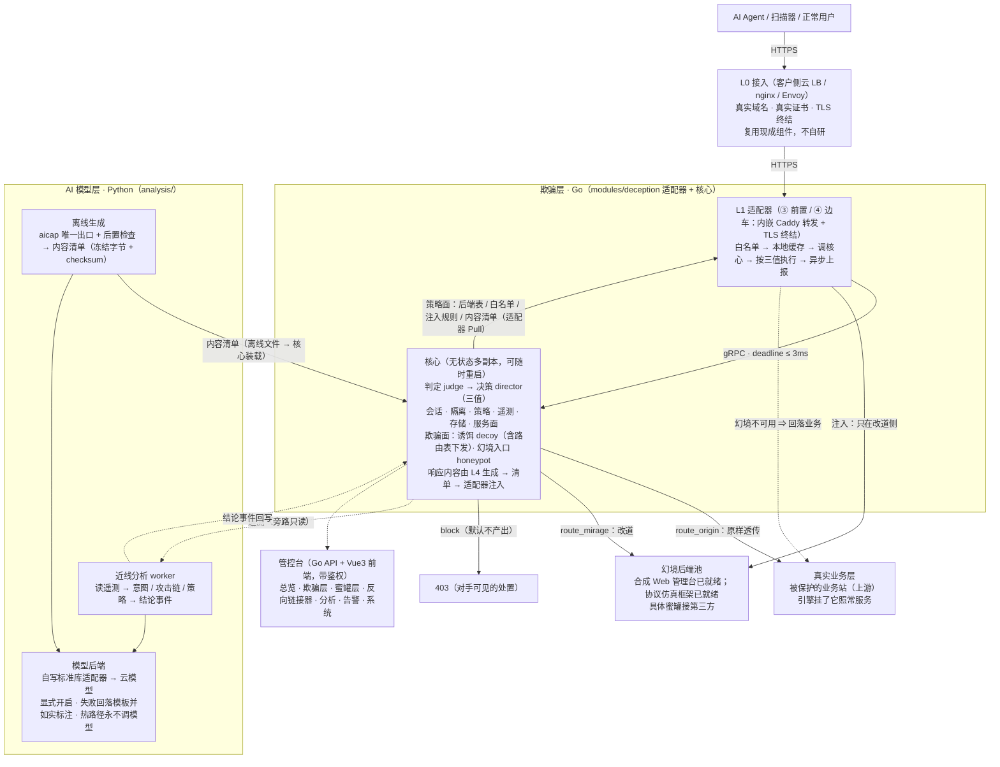

<div align="center">


# 蜃楼 · Shen

**AI 欺骗引擎** —— 把已识别的自动化对手透明送进合成幻境；真实业务零改造、零影响。

[](LICENSE)
[](go.mod)
[](analysis/pyproject.toml)
[-2FD4C6.svg)](#5-模块与职责)
[](#6-工程化与验证)

</div>

**导览**：[1 它是什么](#1-它是什么) · [2 启动与运行](#2-启动与运行) · [3 如何使用](#3-如何使用) · [4 架构与原理](#4-架构与原理) · [5 模块与职责](#5-模块与职责) · [6 工程化与验证](#6-工程化与验证) · [7 成熟度与边界](#7-成熟度与已知边界) · [8 目录与许可](#8-目录文档与许可)

---

## 1. 它是什么

不拦截可疑流量，而是**把已识别的自动化对手透明送进幻境**：对手以为在打真站，工具、意图与攻击链暴露在受控的合成世界里；真实用户与真实业务**完全不受影响**。

- **形态**：一个独立服务 + 接入物料 —— 不是 SDK、不是业务中间件，**不要求改一行业务代码**。
- **四种接入**：① 旁路镜像（唯一不在请求路径上，只观察）· ② DNS 引流（纯配置）· ③ 反向代理前置 · ④ Sidecar（③④ 是同一份实现的两个部署位置）。
- **术语**：**幻境**（mirage）= 合成环境 · **诱饵**（decoy）= 投放在幻境侧的素材与路径 · **三值决策** = `route_origin` / `route_mirage` / `block`。

### 三条设计底线（不可协商）

| # | 底线 | 兑现方式 |
| --- | --- | --- |
| 1 | **不影响原始业务** | 引擎故障 / 超时 / **任何未识别状态**一律放行到真实业务；幻境后端不可用**回落**业务；专属诱饵路由故障**固定 502、绝不回源** |
| 2 | **决策只有三值** | `route_origin` / `route_mirage` / `block`，**禁止**第四值；加重用 `severity` 旁路字段；**禁止**弹挑战页（那是 WAF 的形态，不是欺骗） |
| 3 | **判定只实现一次** | 判定与响应生成**只在核心**；边缘适配器**只执行、不判定**（`make archcheck` 强制） |

### 使用边界（动手前先读）

| 项 | 说明 |
| --- | --- |
| **仅限授权环境** | **仅限**你拥有或已获书面授权的站点与环境使用 |
| **不做控制面** | **禁止**实现 C2、载荷投递、木马、向第三方 Agent 下发指令；引擎是**被动组件**，不主动连接目标 |
| **只用自己的素材** | 幻境内容**必须**基于自有素材或已获授权的站点；**禁止**伪造第三方品牌 |
| **对外可见面零自曝** | 攻击者可见的任何位置**禁止**出现「蜜罐 / decoy / mirage / 决策分数」等字样 —— 有 `make leakcheck` 自动兜底 |

---

## 2. 启动与运行

### 2.1 Docker 一键起全套

```sh
make start        # = scripts/shen.sh up；自动等就绪并打印地址
```

| 地址 | 是什么 |
| --- | --- |
| http://127.0.0.1:19444/ | **管控台**（默认 admin/admin，首登强制改密）|
| http://127.0.0.1:18080/ | **业务入口**（经引擎；默认影子模式：只观测、不处置）|

```sh
curl -s -A "HeadlessChrome/120" http://127.0.0.1:18080/.git/config   # 探针：控制台应显示高分与命中信号
curl -s -A "Mozilla/5.0"        http://127.0.0.1:18080/               # 正常浏览器：低分、原样放行
```

`make docker-ps`（状态）· `make docker-log S=core`（日志）· `make down`（停止）·
端口冲突时 `SHEN_HTTP_PORT=8080 SHEN_CONSOLE_PORT=9444 make start`。

### 2.2 没有 Docker：本机直跑三件套

```sh
scripts/dev/local-stack.sh up          # 核心（影子）+ 反向代理 + 管控台 + Vite 前端，全本机进程
scripts/dev/local-stack.sh seed        # 造 3 条判定流量（判定流里有数据可点）
scripts/dev/local-stack.sh status      # 看进程 / 端口 / 健康检查
scripts/dev/local-stack.sh logs core   # 单组件日志（core / proxy / console / ui）
scripts/dev/local-stack.sh stop        # 停栈
```

| 地址 | 是什么 |
| --- | --- |
| http://127.0.0.1:5173/ | 管控台前端 |
| http://127.0.0.1:9445/healthz | 管控台 API |
| http://127.0.0.1:18080/ | 业务入口（经引擎）|

### 2.3 源码直跑（改代码时用）

前置 **Go 1.26+**；跑 L4 与门禁另需 **Python 3.13+**（环境建在 `analysis/.venv`）。无外部服务依赖。

```sh
make tools && make pyenv   # 首次：门禁工具进 scripts/bin/、建 Python 环境
make run                   # 起核心（影子模式），监听 127.0.0.1:9443
make smoke                 # 另开终端：对判定面发三个样本
SHEN_PROXY_UPSTREAM=http://127.0.0.1:9000 go run ./modules/deception/proxy/cmd/proxy   # 起反向代理前置
```

### 2.4 常用命令

| 命令 | 用途 |
| --- | --- |
| `make help` | 全部命令 |
| `make check` | 快速内循环：构建 + 格式化 + vet + 架构 + 泄漏 |
| `make gate` | 一轮验收：check + 许可审计 + `-race` + pytest |
| `make dev` | 开发验证：配置干跑 → 起核心 → 冒烟 → 规则回放 → L4 |
| `make traffic` | 伪造流量，从观测面核对判定 / 落点 / 注入 |
| `make verify` | 端到端核对（含 DAG 与 L4 结论） |
| `make verify-modules` | 逐模块证据（文档 / 规则 / 测试 / 场景 + 用例数） |
| `make doctor` · `make ai-check` · `make bench` | 接入自检 · AI 内容注入端到端 · 延迟基准 |

---

## 3. 如何使用

### 3.1 接入一个真实业务（三步）

| 步 | 做什么 | 在哪 |
| --- | --- | --- |
| ① | 控制台「接入管理」**签发凭证**：绑定服务名 + 域名白名单，明文只显示一次，落库只存 SHA-256 | 管控台 |
| ② | 凭证与接入代码交给业务侧，**跑连接器**（独立二进制 env，或 SDK 三行代码）| 业务侧 |
| ③ | 连接器向外拨号完成 TLS 握手并**自动登记**；控制台看在线 / 心跳 / RTT，可吊销 / 重置 | 管控台 |

一键演示：`demo/up.sh` —— 蜃景商城经反向隧道接入的完整流程（签发 → 拨入 → 自动登记 → 真流量验证），
步骤、配置与截图见 [`demo/README.md`](demo/README.md)。

### 3.2 看什么（浅色主题「晨雾」）

| | |
| --- | --- |
|  |  |
| *总览：新流量 · 来源归属地 · 流入蜃楼占比* | *接入管理：反向隧道凭证与实时会话（在线 / 心跳 / RTT），可吊销 / 重置* |
|  |  |
| *反向链接器：按服务观测（demo 服务为连接器自动登记）* | *欺骗层：判定流逐行（决策 / 信号 / 风险分），点行看逐跳链路* |

<sub>界面默认深色主题「蜃海」，上图切换为浅色主题「晨雾」；主题按账号保存在服务端，点击才切换。</sub>

### 3.3 攻击模拟与验证档

```sh
demo/attack.sh      # 七类攻击探针；结果看「欺骗层 · 判定流」与「告警」
make traffic        # 全场景伪造流量核对（场景在 demo/traffic/）
```

验证「诱饵路由 → 合成后端」这条链要**叠加验证档**（默认栈不登记诱饵路由，且默认影子模式）：

```sh
docker compose -f compose.yaml -f deploy/docker/compose.verify-mirage.yaml up -d --force-recreate
curl -s http://127.0.0.1:18080/admin/login                        # 合成登录页
curl -s -c /tmp/jar -d 'username=x&password=y' http://127.0.0.1:18080/admin/login
curl -s -b /tmp/jar http://127.0.0.1:18080/admin/api/users?page=1
docker compose -f compose.yaml -f deploy/docker/compose.verify-mirage.yaml down
```

- 登录输入**只用合成值**：合成后端不校验凭据，切勿输入任何真实凭证。
- `/admin` 是**路径归属**：真实站点若已有 `/admin`，验证档会把它接走 —— 启用中的诱饵资产必须声明主机名（禁止裸 `*`）。
- **撤销 ≠ 立刻还给业务**：路由移除后，边缘在墓碑租约内（默认 24h）对这些路径固定 502、绝不回源。
- 两种失败语义别混：诱饵路由故障 ⇒ 固定 502；普通 `route_mirage` 故障 ⇒ 回落业务。

---

## 4. 架构与原理

### 4.1 模块全景

[](assets/architecture/panorama.html)

<sub>实线 = 流量进入后的流转，虚线 = 建立接入的调用；分层带 = 数据面 / 决策与欺骗面 / 管控与分析面；
客户网络里业务只听回环，唯一通路是连接器外拨的隧道（防火墙仅放行出站）。
[矢量源图 ↗](assets/architecture/panorama.html)</sub>

### 4.2 两种视角

| 开发者视角（接入与运行） | 流量视角（检测与分流） |
| --- | --- |
| [](assets/architecture/developer-view.html) | [](assets/architecture/traffic-view.html) |
| ①→⑩ 接入链：签发 → 交付 → 部署 → 握手 → 自动登记 → 交引擎 → 回环转发 → 观测吊销 | 外部流量 → 反向代理处理链 → 三值分流：正常流量经隧道回源到后台服务，恶意流量被引进蜜罐 |

<sub>三张图的矢量源（`assets/architecture/*.html`）可点开交互，页内 `layoutReport()` 是排版自检
（逐条查连线穿框 / 线线交叠 / 标签重叠 / 框压框 / 文字溢出 / 框越区，当前 **0 违规、0 交叉**）。</sub>

### 4.3 三值决策

| 决策 | 去向 | 对手看到的 | 业务受到的影响 |
| --- | --- | --- | --- |
| `route_origin` 放行 | 真实业务（隧道 / 直连） | 正常业务页面 | 无（正常用户原样通行） |
| `route_mirage` 改道 | 合成幻境 + AI 内容 | 以假乱真的站点，攻击链被完整记录 | 零（请求根本没到业务） |
| `block` 拦截 | 403 | 明确拒绝（只用于已知恶意） | 零 |

判定只在核心产生（边缘只执行）；引擎故障 / 超时 / 未识别一律放行业务 —— 欺骗建立在「业务永远可用」之上。

### 4.4 端到端链路

```text
客户端 → L0 接入（客户侧 LB/nginx：真实域名与证书）→ L1 适配器
   ① 会话身份（最小身份值，整段 Cookie 不跨接缝）
   ② 专属诱饵路由（Host + 归一化路径 + 段边界，命中即投递）
   ③ 白名单（本地与策略面取并集）
   ④ 本地判定缓存（键含方法/路径/查询串/UA/Host/策略版本）
   ⑤ 调核心判定（gRPC，预算 ≤ 3ms；失败即放行）
   ⑥ 按三值执行（透传 / 改道 / 403）
   ⑦ 异步上报（有界队列 + 丢弃计数）
        ↓ 遥测
   核心：observer → judge（风险分）→ director（三值 + 灰度）→ 路由
        ↑ 策略面      边缘 Pull：后端表 · 白名单 · 注入规则 · 内容清单（+ 回执对账）
   L4（Python）：离线生成内容（唯一护栏出口）· 近线分析（意图/攻击链/策略，按会话分组、按游标增量）
   合成后端：Web 管理台场景包（登录 → 演示会话 → 总览/用户/配置/审计 + JSON API + 受限写）
   观测面：只读控制台（概览 · 逐请求链路 DAG · 配置 · 告警 · 原始事件 · 分析结论）
```

<details>
<summary>架构图（点击展开）</summary>


```mermaid
flowchart TB
  U["AI Agent / 扫描器 / 正常用户"]
  L0["L0 接入（客户侧云 LB / nginx / Envoy）<br/>真实域名 · 真实证书 · TLS 终结<br/>复用现成组件，不自研"]

  subgraph D["欺骗层 · Go（modules/deception 适配器 + 核心）"]
    AD["L1 适配器（③ 前置 / ④ 边车：内嵌 Caddy 转发 + TLS 终结）<br/>白名单 → 本地缓存 → 调核心 → 按三值执行 → 异步上报"]
    CO["核心（无状态多副本，可随时重启）<br/>判定 judge → 决策 director（三值）<br/>会话 · 隔离 · 策略 · 遥测 · 存储 · 服务面<br/>欺骗面：诱饵 decoy（含路由表下发）· 幻境入口 honeypot<br/>响应内容由 L4 生成 → 清单 → 适配器注入"]
  end

  WEB["真实业务层<br/>被保护的业务站（上游）<br/>引擎挂了它照常服务"]
  HON["幻境后端池<br/>合成 Web 管理台已就绪；协议仿真框架已就绪<br/>具体蜜罐接第三方"]
  BLK["403（对手可见的处置）"]

  subgraph A["AI 模型层 · Python（analysis/）"]
    GEN["离线生成<br/>aicap 唯一出口 + 后置检查 → 内容清单（冻结字节 + checksum）"]
    NEAR["近线分析 worker<br/>读遥测 → 意图 / 攻击链 / 策略 → 结论事件"]
    MODEL["模型后端<br/>自写标准库适配器 → 云模型<br/>显式开启 · 失败回落模板并如实标注 · 热路径永不调模型"]
  end

  CON["管控台（Go API + Vue3 前端，带鉴权）<br/>总览 · 欺骗层 · 蜜罐层 · 反向链接器 · 分析 · 告警 · 系统"]

  U -->|HTTPS| L0
  L0 -->|HTTPS| AD
  AD -->|"gRPC · deadline ≤ 3ms"| CO
  CO -->|"route_origin：原样透传"| WEB
  CO -->|"route_mirage：改道"| HON
  CO -->|"block（默认不产出）"| BLK
  CO -->|"策略面：后端表 / 白名单 / 注入规则 / 内容清单（适配器 Pull）"| AD
  AD -->|"注入：只在改道侧"| HON
  AD -.->|"幻境不可用 ⇒ 回落业务"| WEB
  GEN -->|"内容清单（离线文件 → 核心装载）"| CO
  GEN --> MODEL
  NEAR --> MODEL
  CO -.->|"遥测（旁路只读）"| NEAR
  NEAR -.->|"结论事件回写"| CO
  CO -.-> CON
```

</details>

---

## 5. 模块与职责

> **清单来源**：设计文档的模块表（一模块一文件：职责 · 契约 · 规则 · 测试 · 未决项）。
> `make verify-modules` 逐模块跑测试目标并核对「文档 ↔ 规则 ↔ 测试 ↔ 功能场景」—— 当前 **24 个模块全部通过**
> （`adapter-dns` / `netpolicy` 声明为无源码、`honeypot-shell` 待建，工具会**打印豁免原因**而非静默跳过）。

### 核心（Go · 判定与平台能力）

| 模块 | 职责 | 状态 |
| --- | --- | --- |
| `judge` | 把观测变成判定：风险分 · 信号 · 证据链（纯函数，无 I/O） | ✅ |
| `director` | 决策与后端选择：阈值 → **三值** + 灰度收敛 + 白名单优先 | ✅ |
| `session` | 会话身份提取（业务 Cookie → TLS ticket → 指纹）与状态抽象 | ✅ |
| `policy` | 配置装载与校验 · 策略快照与 **Pull/Ack** 下发 · 边缘载荷投影（后端表/白名单/注入/内容/诱饵路由） | ✅ |
| `telemetry` | 事件归一化 · 异步上报 · 失败缓冲与丢弃可见性 | ✅ |
| `store` | 存储访问层（**核心唯一 I/O 出口**）：当前内存实现，外部存储属后续阶段 | 🟡 内存 |
| `control` | gRPC 服务面：判定/遥测/策略三面 + 只读快照 · **禁止回显的强制点** | ✅ |
| `decoy` | 诱饵面：功能性伪装诱饵（开发者 API / 指令文件 / MCP / 数据集）+ 蜜饵 · 产出投放意图与片段 | ✅ |
| `honeypot` | 幻境入口与后端池：类型注册 · 开关 · 生命周期 · 逻辑名到实例的解析（**不实现具体蜜罐**） | ✅ |
| `isolation` | 隔离记录写入 / TTL 过期 / 查询短路 | ✅ |

### L1 边缘与接入

| 模块 | 职责 | 状态 |
| --- | --- | --- |
| `adapter-proxy` | **③ 反向代理前置 与 ④ Sidecar 的同一份实现**：拦截 → 调核心 → 按三值选 upstream → 注入改写 → 异步上报；内嵌 Caddy（转发与 TLS 复用现成组件） | ✅ |
| `adapter-mirror` | 只读采集（旁路镜像，**不在请求路径**）：观测副本与流量记录 | ✅ |
| `adapter-dns` | 按来源解析到引擎或真实服务（**纯配置，无源码**） | ✅ 配置 |
| `edge-injection` | 响应改写 / 假路径 / 蜜饵注入（被适配器引用，**不独立部署**） | ✅ |
| `connector` | **反向隧道连接器**（平台网关 + 业务侧 SDK / 二进制）：业务零入站暴露，凭证（`shc-`，一 key 一服务一域名白名单）校验、会话池、按 Host 经隧道转发；握手自动登记到控制台（来源=连接器） | ✅ |

### L2 幻境后端

| 模块 | 职责 | 状态 |
| --- | --- | --- |
| `honeypot-web` | **合成 Web 管理台场景包**：登录 → 合成演示会话（或合成失败）→ 总览/用户/配置/审计 + JSON API；页面与 API **同源分页**；**受限写**（幂等 + CAS + 配额，只改内存合成对象） | ✅ |
| `honeypot-protocol` | 协议仿真（SSH / MySQL / Redis / FTP）+ 交互捕获：注册表 · 连接上限 · 运行框架 | 🟡 框架 |
| `honeypot-shell` | 命令表分发 · 内存文件系统 · 文件投递 | ⏸ 待建 |

### L3 网络策略 · L4 智能 · 控制台

| 模块 | 职责 | 状态 |
| --- | --- | --- |
| `netpolicy` | 微隔离 · 假拓扑 · 运行时检测与阻断（声明式产物，**无源码**） | ✅ 声明式 |
| `ai-capability` | **AI 能力服务**：唯一生成出口 `generate(TaskSpec) → Envelope`，**内部强制走护栏**（前置提示词 + 后置独立校验）；否则任务拒绝 | ✅ |
| `llm-components` | 契约校验 · 容错解析 · 两阶段收尾 · 内容黑名单 | ✅ |
| `intent` | 意图识别（引用的证据必须存在，否则结论作废） | ✅ |
| `chain` | 攻击链还原 | ✅ |
| `strategy` | 策略生成 | ✅ |
| `console` | 管控台：登录鉴权（本地账号 + 管理员/欺骗运维/蜜罐运维/只读）· 总览（来源归属地）· 欺骗层 · 蜜罐层 · 反向链接器登记与按服务观测 · **接入管理（反向隧道凭证签发/吊销/重置与实时会话观测）** · 分析（大模型对话/用量/L4 结论）· 告警 · 系统审计（**观测+登记，不下发策略**） | 🟢 可用 |

### 工程工具

| 工具 | 职责 |
| --- | --- |
| `doctor` | 接入自检（五项） |
| `check-leak` | 对外可见面禁用串扫描（`OH-1`） |

---

## 6. 工程化与验证

### 6.1 门禁：`make gate` 一条命令把「能不能发」问清楚

```text
staticcheck · errcheck · gofmt · go vet · archcheck · tracecheck · leakcheck · licensecheck
                                                                          + go test -race + pytest
```

含**密钥泄漏门禁**（`make secrets-check`，并入 gate）：拦截 `sk-` 真值与密钥类变量的非占位赋值进入版本库；模型密钥只走 `SHEN_AI_KEY` 环境变量（`ST-20`：密钥不入日志）。

| 检查 | 防的是什么 |
| --- | --- |
| `archcheck` | 分层与依赖方向（核心不依赖适配器 · 适配器不互依 · 模块不链核心内部）· 语言层数上限 · CGO 禁令 · **判定三值闭集** · 响应路径非确定性 · L4 不碰写侧 |
| `tracecheck` | 追溯链断裂：模块文档 ↔ 代码 ↔ 单测 · 规则引用是否存在 · 变更包与变更日志 · 过期状态标记 · 悬空链接 |
| `leakcheck` | 对外可见面的自曝字面量（豁免必须**逐条登记并写理由**，会腐烂的豁免会被报出来） |
| `licensecheck` | 依赖许可台账（根许可证 Apache-2.0，第三方各自约束） |
| `go test -race` / `pytest` | 并发正确性与近线分析；**不绿不算完成**：禁止注释/跳过/绕过检查 |

### 6.2 证据链：每一轮开发都留可复核的痕迹

| 产物 | 内容 |
| --- | --- |
| 变更包 | 需求 → 设计逻辑 → **追溯矩阵**（规则 ↔ 文档章节 ↔ 代码 ↔ 测试）→ 代码 → 场景表 → **验证证据** → 审视记录 |
| 变更日志 | 每轮一条：做了什么 / 改了哪些文件 / 验证 / 证据 / 遗留 |
| 命令输出 | 效果类与对抗性结论必须给**原始输出行**（能反驳「你跑了吗」） |
| `verify-modules` | 逐模块跑测试目标并出表：文档 · 规则 · 测试 · 实际用例数 · 功能场景 |

### 6.3 测试与覆盖率（本机实测，`make coverage`）

| 指标 | 值 |
| --- | --- |
| Go 测试函数 | **388** 个（20 个包，`-race` 全绿） |
| Python 测试 | **143 passed**（L4 分析链路） |
| 语句覆盖（核心与边缘） | `director` · `session` · `isolation` · `honeypot` · `injection` **100%** · `decoy` 96.6% · `adapter-proxy` 90.1% · `policy` 88.9% · `telemetry` 88.7% · `mirror` 87.3% · `judge` 87.0% · `honeypot-web` 82.6% |
| 端到端 | `make dev`（配置干跑 → 起核心 → 冒烟 → 规则回放 → L4）· `make traffic`（逐场景核对分数/决策/落点/注入）· `make verify` · `make doctor` · `make ai-check` |

> 覆盖率**不是**欺骗效果的证据 —— 它只说明代码被跑过。「效果」需要对照实验（见 §6「还没接什么」）。

### 6.4 离线可重复 & 一条命令起栈

- 依赖 **vendor 入库**：Go 侧构建与门禁**不需要网络**；工具装在 `scripts/bin/`。
- **Docker 一键起全套**：核心 / 适配器 / 控制台 / 演示业务（默认影子模式）。
- 配置即数据：阈值 · 规则 · 白名单 · 诱饵资产 · 注入规则 · 内容清单全部经**策略面**下发，边缘只执行（改策略不用改代码、不用重启边缘）。

---

## 7. 成熟度与已知边界

### 7.1 阶段

| 阶段 | 内容 | 状态 |
| --- | --- | --- |
| **1 · MVP（只观察）** | 判定 · 会话 · 遥测 · 存储 · 旁路镜像 · 服务面 | ✅ |
| **2a · 接管与引流** | 策略装载与下发 · 三值决策 + 灰度 · 反向代理前置与边车 · DNS 引流模板 | ✅ |
| **2b · 处置内容** | 诱饵面 · 幻境后端池 · 边缘注入 · AI 欺骗内容 · 合成 Web 管理台（含受限写）· 诱饵路由下发 | 🟡 已实现并端到端实测；**业务侧线索投放未做**（见下） |
| **3 · 高交互与智能** | 协议仿真蜜罐 · 蜜网 · LLM 会话 · 意图/攻击链/策略 | 🟡 接入架构与 L4 已就绪；**具体蜜罐接第三方** |
| **效果验证** | 自主进入率 / 有效交互率 / 误伤预算 | ⏸ 需对照实验（B0/B1/B2） |

### 7.2 明确还没做（不写「已具备」）

| # | 未做 | 影响 |
| --- | --- | --- |
| 1 | **业务侧线索投放**（往真实业务响应里放线索） | 线索目前只能出现在**幻境侧**；「自主发现入口」这一步缺业务面载体（属能力边界变更，需显式批准） |
| 2 | **绑定契约**（业务模块 → 线索 → 资源 → 场景 → 沙箱的一一映射） | 当前按 Host + 路径归属投递；「哪个业务模块该看到哪套诱饵」尚未建模 |
| 3 | **沙箱编排与就绪门禁** | 现有后端地址表 + TCP 探针**不是**沙箱生命周期控制器；计划态尚无「未就绪不投放」的硬门禁 |
| 4 | **合成交互事件回流核心** | 管理台的登录/浏览/受限写事件目前只进本地日志，效果漏斗缺一段 |
| 5 | **墓碑持久化** | 搜索碑租约在进程内；重启后依赖策略重新下发才恢复保护 |
| 6 | **多租户 / 一进程多场景** | 每个 Web 后端进程服务一套场景；按 Host/租户同时服务多套未做 |
| 7 | ~~控制台鉴权~~ → **已交付**（本地账号 + argon2id + 四角色 RBAC + CSRF/Origin 校验 + 审计）；剩余：OIDC/SSO 对接、可写下发策略的审批流 | 

> 安全硬边界（不泄露生产权限 · 不误投其他 Host · 不回源）**每次都有测试与端到端证据**；
> 能力缺口按上表如实标注，不用「模块数量 / 测试通过率」替代「欺骗效果」。

---

## 8. 目录、文档与许可

```text
modules/            四个产品模块（一子目录 = 一大模块）
  ├─ deception/     L1 边缘：反向代理前置与边车 · 旁路镜像 · DNS 模板 · 边缘注入
  ├─ honeypot/      L2 幻境后端：合成 Web 管理台 · 协议仿真框架
  ├─ console/       管控台（API + Vue 3 UI；观测 + 登记，不下发策略）
  └─ connector/     连接器：网关（接入 · 会话 · 字节桥）+ 业务侧 SDK 与二进制
common/
  ├─ core/          判定与响应生成的唯一实现（judge · director · policy · session · telemetry · store · decoy）
  └─ api/           跨进程契约（.proto：judge / policy / telemetry / connector）
analysis/           L4（Python）：AI 能力护栏出口 · 意图/攻击链/策略 · 近线 worker
deploy/            Docker Compose 叠加档 · 示例配置 · 验证档（deploy/docker · deploy/config）
scripts/           门禁与工程工具（archcheck · tracecheck · leakcheck · verify · doctor · dev/local-stack.sh）
demo/              可跑通的最小样例：假业务 + 连接器 + 界面截图（入口 demo/README.md）
assets/            logo · 架构图（assets/architecture/：三张图的矢量源 HTML + 导出 PNG）
compose.yaml       部署入口（根级基础档；dev / prod / verify 叠加档在 deploy/docker/）
Makefile           统一入口：make gate · make dev · make traffic · make verify …
vendor/            第三方依赖副本（vendor 模式构建；许可证台账见 make licensecheck）
```

| 我要做的事 | 去哪 |
| --- | --- |
| 理解设计与约束 | 设计文档（架构 · 接入 · 语言 · 模块 · 目录 · 硬约束 · 术语）—— 与仓库**分开发布** |
| 查模块职责与契约 | 模块文档（一模块一文件）· 契约在 `common/api/` 与 `common/core/internal/contract/` |
| 看它「现在能做什么」 | 本 README §7 + 变更日志 |
| 看图（架构 / 接入 / 流量） | §0 的三张图；矢量源 `assets/architecture/*.html`（可点开交互，页内 `layoutReport()` 自检排版） |
| 复现一次验证 | §2 的 `make gate` / `make dev` / `make traffic` / `make verify` |

**许可**：Apache-2.0（见 [LICENSE](LICENSE)）。第三方依赖各受自身许可证约束（有意保持可审计，见依赖台账目标 `make licensecheck`）。

<div align="center">
<sub>蜃楼 Shen · 让自动化对手把力气花在不存在的地方</sub>
</div>
