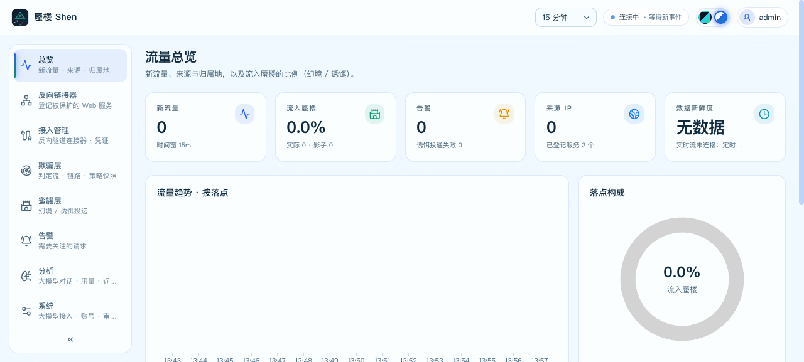
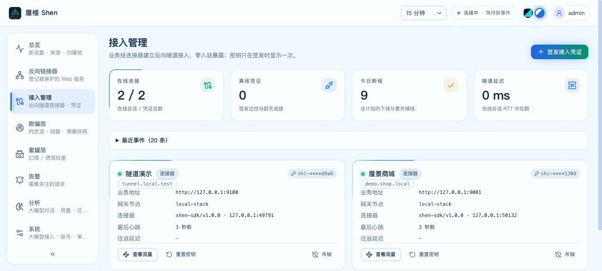
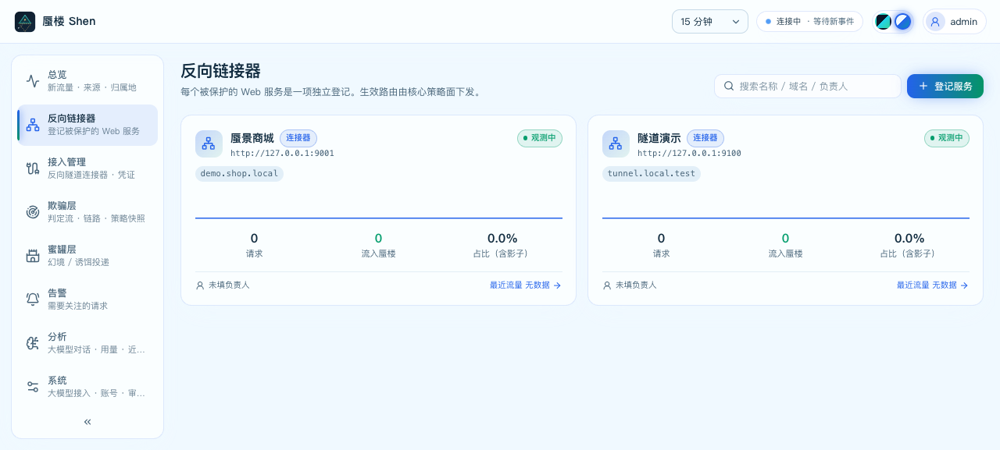
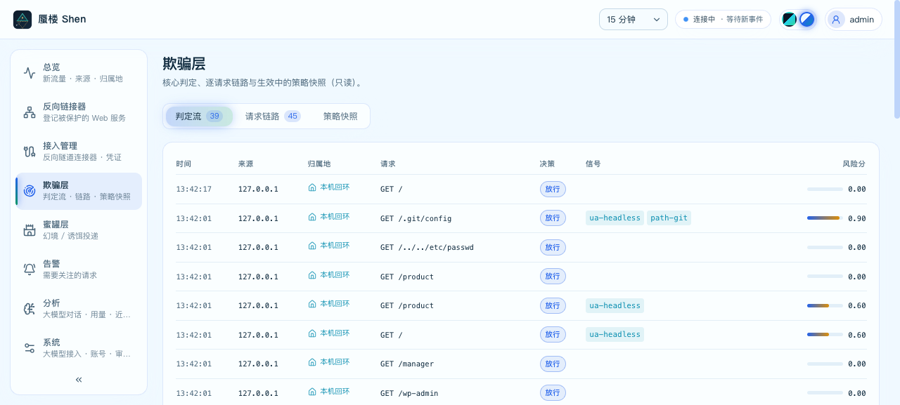
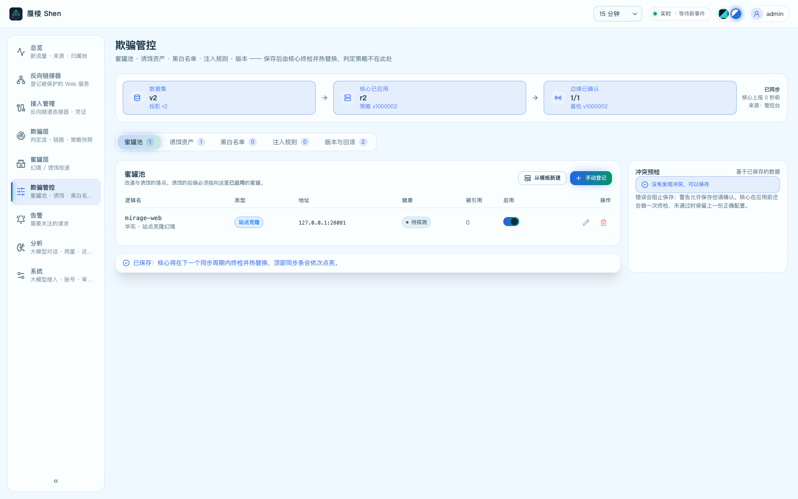
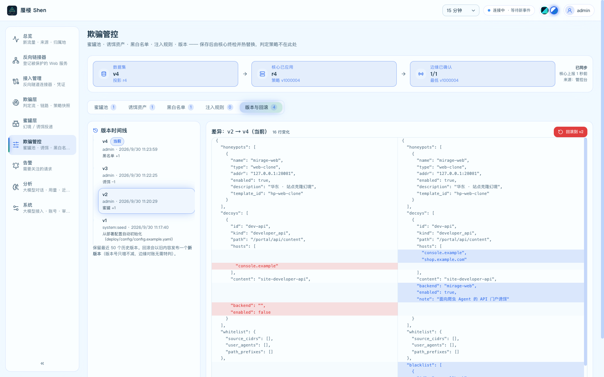
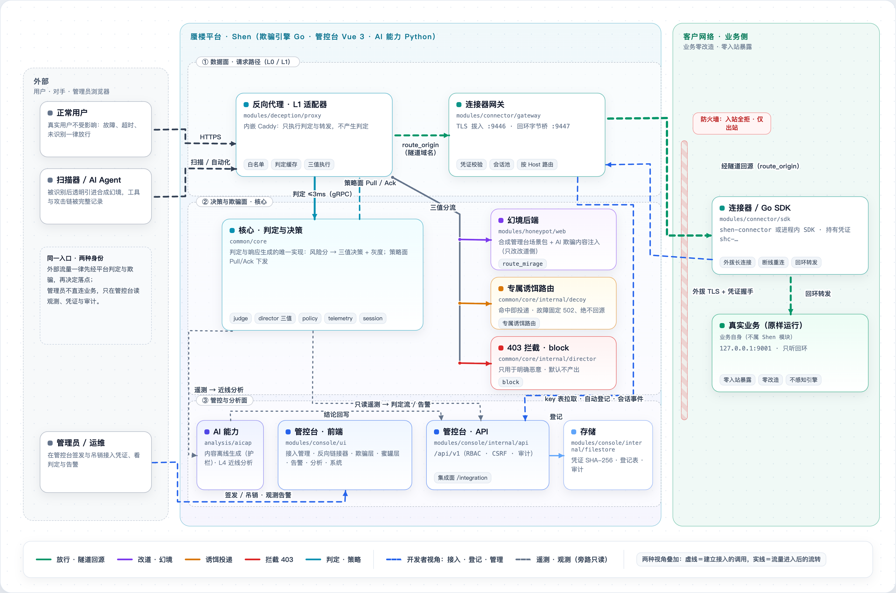
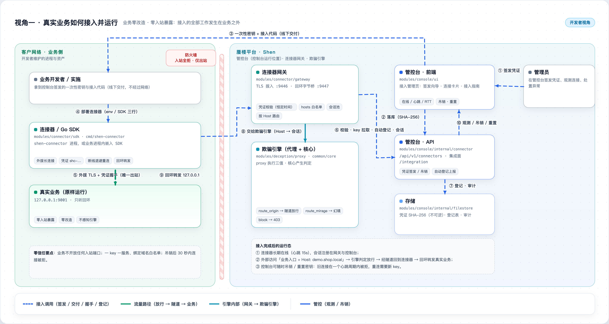
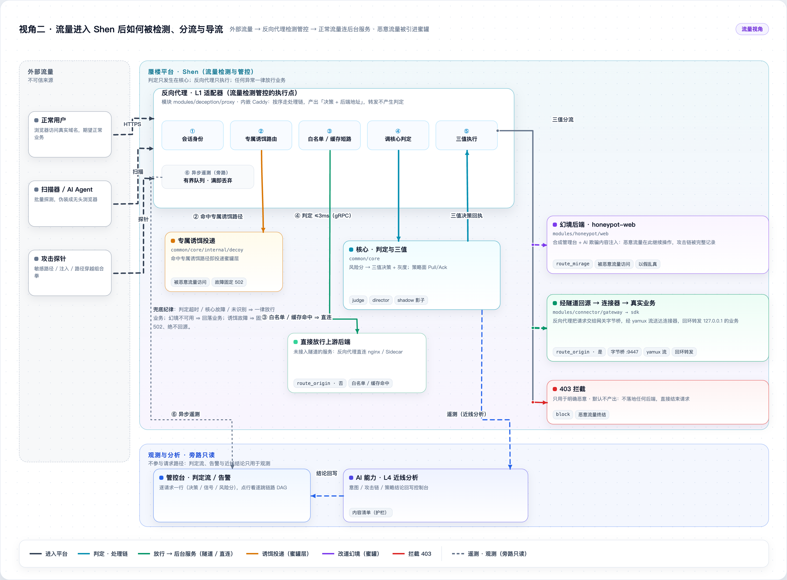

<div align="center">


# 蜃楼 · Shen

**AI 欺骗引擎** —— 把已识别的自动化对手透明送进合成幻境；真实业务零改造、零影响。

[](LICENSE)
[](go.mod)
[](analysis/pyproject.toml)
[-2FD4C6.svg)](#5-模块)
[](#6-工程化)

</div>

**导览**：[1 它是什么](#1-它是什么) · [2 快速开始](#2-快速开始) · [3 本地调试](#3-本地调试) · [4 如何使用](#4-如何使用) · [5 架构](#5-架构) · [6 模块](#6-模块) · [7 工程化](#7-工程化) · [8 成熟度](#8-成熟度) · [9 目录与许可](#9-目录与许可)

---

## 1. 它是什么

不拦截可疑流量，而是**把已识别的自动化对手（扫描器 / 爬虫 / AI Agent）透明送进幻境**：对手以为在打真站，工具、意图与攻击链暴露在受控的合成世界里；真实用户与真实业务**完全不受影响**。

| 常见做法 | 蜃楼的做法 |
| --- | --- |
| 拦截 / 封 IP | **不拦截**：送进幻境，让对手在假世界里暴露工具与攻击链 |
| 业务侧埋 SDK / 改代码 | **零改造、零入站暴露**：连接器从业务侧向外拨号建隧道，业务只听回环 |
| 只给告警 | **可观测 + 可管控**：判定流逐跳链路 · 告警 · 审计；蜜罐池 / 诱饵 / 黑白名单在界面管控，经核心拉取终检后热替换 —— 判定策略仍不下发 |

**三值决策**（判定只产出这三个值，禁第四值）：

| 决策 | 去向 | 对手看到的 | 业务影响 |
| --- | --- | --- | --- |
| `route_origin` 放行 | 真实业务（隧道 / 直连） | 正常业务页面 | 无 |
| `route_mirage` 改道 | 合成幻境 + AI 内容 | 以假乱真的站点，攻击链被完整记录 | 零（请求没到业务） |
| `block` 拦截 | 403 | 明确拒绝（只用于已知恶意） | 零 |

**三条底线**：① 引擎故障 / 超时 / 未识别 ⇒ **一律放行业务**；② 决策**只有三值**，禁止弹挑战页；③ **判定只在核心实现一次**，边缘只执行（`make archcheck` 强制）。

> **使用边界**：仅限你拥有或已获书面授权的环境；禁止实现 C2 / 载荷投递 / 向第三方下发指令；幻境内容必须用自有或已授权素材（禁止伪造第三方品牌）；对外可见面禁止出现「蜜罐 / decoy / mirage」等字样（`make leakcheck` 兜底）。

---

## 2. 快速开始

### 2.1 起栈（Docker）

```sh
make start          # 自动等就绪并打印地址
```

> 想让「欺骗管控」页的修改下发生效：在 `.env` 里设 `SHEN_CORE_SYNC_TOKEN`（核心与管控台同一个值）。
> 不设也能用：界面可编辑，核心按部署配置运行，同步条会显示「未启用同步」。

| 地址 | 是什么 |
| --- | --- |
| http://127.0.0.1:19444/ | **管控台**（默认 admin/admin，首登强制改密）|
| http://127.0.0.1:18080/ | **业务入口**（经引擎；默认影子模式：只观测、不处置）|

```sh
curl -s -A "HeadlessChrome/120" http://127.0.0.1:18080/.git/config   # 探针 → 控制台显示高分与命中信号
curl -s -A "Mozilla/5.0"        http://127.0.0.1:18080/               # 正常浏览器 → 低分、原样放行
```

### 2.2 起栈（无 Docker，全本机进程）

```sh
scripts/dev.sh up         # 核心（影子）+ 反向代理 + 管控台 + Vite 前端
scripts/dev.sh seed       # 造 3 条判定流量（判定流里有数据可点）
scripts/dev.sh update     # 改完 Go 代码：重编并滚动重启后端（前端由 Vite 热更新）
scripts/dev.sh status     # 进程 / 端口 / 健康检查
scripts/dev.sh ui check   # 验证页面真的显示出来：HTTP → 登录 → 浏览器逐页渲染 + 截图
```

全部脚本的用法见 [`scripts/README.md`](scripts/README.md)。

| 地址 | 是什么 |
| --- | --- |
| http://127.0.0.1:5173/ | 管控台前端（Vite） |
| http://127.0.0.1:9445/healthz | 管控台 API |
| 127.0.0.1:9443 | 核心 gRPC 判定面（`make smoke` / `make analysis` 打这里）|
| http://127.0.0.1:18080/ | 业务入口（经引擎）|

### 2.3 常用命令

| 命令 | 用途 |
| --- | --- |
| `make gate` | 一轮验收：格式 · vet · 架构 · 追溯 · 泄漏 · 许可 + `go test -race` + pytest |
| `make check` | 快速内循环：构建 + 格式 + vet + 架构 + 泄漏 |
| `make dev` | 开发验证：配置干跑 → 起核心 → 冒烟 → 规则回放 → L4 |
| `make traffic` | 伪造流量，从观测面核对判定 / 落点 / 注入 |
| `make verify` | 端到端核对（含 DAG 与 L4 结论） |
| `make doctor` · `make ai-check` | 接入自检 · AI 欺骗内容注入端到端 |
| `make down` · `make docker-ps` · `make docker-log S=core` | 停止 · 状态 · 日志 |
| `make update` · `scripts/shen.sh update ui` · `make ui-check` | 改代码后整栈更新 · 只更新前端 · 验证 UI 显示 |

只起核心的最小闭环（需 **Go 1.26+**；L4 与门禁另需 **Python 3.13+**）：

```sh
make tools && make pyenv                  # 门禁工具与 L4 环境（首次 / 离线环境）
make run                                  # 前台起核心（影子模式；SHEN_CONFIG 可换配置）
SHEN_DEV_ADDR=127.0.0.1:9443 make smoke    # 另开一个终端：对核心发判定请求
```

改代码看效果、看判定与逐跳链路、调试 L4 —— 完整流程见 [§3 本地调试](#3-本地调试)。

---

## 3. 本地调试

改了代码就要马上看到效果。**默认走本机进程**（`scripts/dev.sh`：Go 与前端都直接跑，不用 Docker、不用重建镜像；
需要 **Go 1.26+ / Node 20+ / python3**，工具不在 `PATH` 里时脚本会去常见安装位置自寻址）；
只有「想验证容器里的样子」时才走 Docker（`make up-dev`，见 §3.6）。

### 3.1 改完怎么生效

```sh
scripts/dev.sh up         # 编译服务 → 起栈并逐个等健康 → 起 Vite（地址见 §2.2）
scripts/dev.sh status     # 谁在跑 / 端口 / 健康检查
scripts/dev.sh logs proxy 100   # 取日志尾部（不跟随，不会挂住终端）
```

| 我改了什么 | 怎么生效 | 命令 |
| --- | --- | --- |
| Go（核心 / 代理 / 管控台 / 网关） | 重编译 → 滚动重启；**编译失败时旧进程继续跑**，不会把你打断 | `scripts/dev.sh update` |
| 前端 `.vue` / `.ts` / 样式 | Vite 热更新，保存即生效 | 不用命令 |
| 前端依赖 / lock 文件 | 自动 `npm ci` 后重启 Vite（`update` 会发现） | `scripts/dev.sh update`（或 `ui update`） |
| 配置（阈值 / 规则 / 白名单） | 改 Docker 形态的 `deploy/config/config.example.yaml`，或本机栈的 `$TMPDIR/shen-<uid>/local-stack/core.yaml`，再重启核心 | `scripts/dev.sh update` |
| 只调前端、不起整栈 | `ui up` 会自动起**最小后端**（核心 + 管控台 API；代理 / 网关 / 连接器都不需要），`ui check` 一命令验证所有页面 | `scripts/dev.sh ui up` → `scripts/dev.sh ui check` |
| 前端对着别处的后端 | 把 API 指过去（脚本不会在本机拉起后端）；对方若设了来源白名单，要含 `http://127.0.0.1:5173` | `SHEN_CONSOLE_API_URL=http://127.0.0.1:19444 scripts/dev.sh ui up` |
| 想从头来一遍 | 停栈再起（会清掉本栈进程，控制台数据保留） | `scripts/dev.sh stop && scripts/dev.sh up` |

进程、配置、证书、日志、控制台数据全在 `${TMPDIR:-/tmp}/shen-<uid>/local-stack/`，看日志不必进容器。

### 3.2 不开浏览器也能看判定

| 想回答的问题 | 命令 |
| --- | --- |
| 这条请求得多少分、命中哪些信号？ | `make replay` —— 打印「样本 → 分数 → 命中信号」。判定响应本身**不回显分值**（`ST-7`），所以只能在这里看；回放样例就是 `common/core/cmd/core/main_test.go` 的 `TestRuleReplay` |
| 配置（含规则）对不对？ | `make check-config SHEN_CONFIG=<配置路径>` —— 装载 + 校验 + 打印策略摘要，不开端口 |
| 正在跑的核心行为对不对？ | `SHEN_DEV_ADDR=127.0.0.1:9443 make smoke` —— 对核心 gRPC 面发 3 条判定请求（响应形状 + `decision_id` 幂等） |
| 一轮开发验证，且不想自己起进程 | `make dev` —— 配置干跑 → 非法配置被拒 → 起核心 → 冒烟 → 规则回放 → L4，跑完自己收尾 |

> ⚠️ `make smoke` 默认打 `127.0.0.1:19443`，那是 **Docker 形态的映射口**；本机栈的核心在 `127.0.0.1:9443`，
> 所以本机栈必须显式给 `SHEN_DEV_ADDR`。Docker 形态请改用 `make app-smoke`（经引擎造流量后看判定）。

### 3.3 看流量与逐跳链路

```sh
scripts/dev.sh seed        # 造 3 条判定流量：1 条高分、2 条放行
scripts/dev.sh tunnel      # 反向隧道端到端：签凭证 → 起连接器 → 用标记文件证明流量真穿了隧道
curl -s -A "HeadlessChrome/120" http://127.0.0.1:18080/.git/config   # 探针；两三秒后在前端看判定流
```

- 前端**欺骗层 → 判定流**点任意一行，看这条请求的逐跳链路（DAG）。
- 逐请求日志：本机 `scripts/dev.sh logs proxy`；容器 `make docker-log S=proxy N=100`。
- **逐判定日志**可结构化：`SHEN_LOG_FORMAT=json` 时输出 `{"msg":"decision","decision_id":…,"action":…,"score":…,"signals":…}`
  （默认 `text`；启动与装载类日志始终是文本，脚本在 `grep` 它们）。按 `decision_id` 与判定流里的行对上。
- 要看模型路径的注入内容：`SHEN_AI_KEY=<你的 key> make ai-check-llm`（未设则回落确定性路径）。

### 3.4 调试 L4（Python）

```sh
make pyenv                                       # 建 analysis/.venv（首次或改锁文件后）
SHEN_CORE_ADDR=127.0.0.1:9443 make analysis      # 跑一轮近线分析（读核心遥测 → 上报结论事件）
SHEN_CORE_ADDR=127.0.0.1:9443 make analysis-llm  # 同上，但走模型路径（SHEN_AI_KEY 未设则回落确定性）
cd analysis && .venv/bin/pytest -k 关键字         # 单个用例（全量：make pytest）
```

要分析的核心得**先有流量**：`scripts/dev.sh seed` 造几条，再跑 `make analysis` 才有事件可读。

改了 `analysis/` 要过风格与静态检查：`make pyfmt-check pylint`。

### 3.5 页面与栈的自检

| 命令 | 验证什么 |
| --- | --- |
| `scripts/dev.sh ui check` | 页面**真的显示出来**：HTTP → 登录 → 逐页**直开** + 逐页**点侧栏**（客户端路由）+ 截图（落在 `$TMPDIR/shen-<uid>/ui-check/<时间戳>/`）。**后端 / 前端没起会自动先拉起**（最小后端 = 核心 + 管控台 API），所以这一条命令就能独立做完 UI 验证 |
| `make ui-check` | Docker 栈同一个检查（`scripts/shen.sh ui-check`） |
| `scripts/dev.sh ui test` | 前端类型检查 + 单测（`vue-tsc` + `vitest`） |
| `make check` · `make gate` | 快速内循环 · 完整门禁（见 §7） |

### 3.6 Docker 开发形态（`make up-dev`）

`make up` 用的是构建好的前端静态资源；`make up-dev`（= `ENV=dev`）换成开发形态，只有三处差异：

- **前端换成 Vite 开发服务器**：宿主机的 `modules/console/ui` 挂载进容器，改源码即热更新（macOS / Windows 走轮询监听）。
- **多发布两个仅开发可用的直连口**：管控台 API `127.0.0.1:19445`（绕开 nginx 同源反代，直接 `curl` `/api/v1`）、
  蜜罐后端 `127.0.0.1:19090`（**绕过引擎**，用来把「引擎判定」与「诱饵后端」两侧的问题分开）。
- **逐请求日志全开**、Cookie 不强制 `Secure`（本机 http）。

容器里跑的是**镜像里的代码**，改完要重建：`scripts/shen.sh update ui`（只前端）或 `scripts/shen.sh update`（整栈）。

### 3.7 常见卡点

| 现象 | 怎么办 |
| --- | --- |
| 登录 401 / 进不去界面 | `up` / `ui up` / `ui check` 结束时会打印当前可用的账号口令（`ui check` 也自动带上）；口令被改过且记录过期时会明说「口令未知」 |
| `up` 报端口被占 | 上次没停干净：`scripts/dev.sh status` 里标「端口被占」的就是残留进程，`lsof -ti tcp:9443 \| xargs kill` |
| 前台 `make run` 之后端口没释放 | `make run` 走的是 `go run`，Ctrl-C 才干净；被强杀会留下孤儿进程（同样用上面的 `lsof` 收尾）。日常更推荐 `scripts/dev.sh`，它按 PID + 端口收干净 |
| 改了 Go 但界面行为没变 | 前端热更新**不会**重载后端：先 `scripts/dev.sh update` |
| 点侧栏切换页面没反应 | 页面资源与服务器不一致（Vite 重新预打包了依赖 / 部署后旧标签页请求不存在的 chunk）：硬刷新（⌘/Ctrl + Shift + R）。应用也会检测到、把原因写进控制台并**自动整页重载一次**；仍失败就在顶部提示「请刷新浏览器」——不会再像以前那样静默无反应 |
| 检查打印「跳过：设计文档不在本仓库」 | `docs/` 不入库（见 §9）：依赖它的检查项会**明示跳过**，不算通过 |
| `make gate` 报缺工具 / 缺 venv | `make tools`（staticcheck · errcheck）· `make pyenv`（L4）—— 门禁**故意不静默跳过** |
| 想给核心打断点 | `SHEN_CONFIG=$TMPDIR/shen-<uid>/local-stack/core.yaml SHEN_LISTEN=127.0.0.1:9543 dlv debug ./common/core/cmd/core`（需自装 delve；换端口是为了不和 `dev.sh` 起的那个撞） |

---

## 4. 如何使用

### 4.1 接入一个真实业务（三步）

| 步 | 做什么 | 在哪 |
| --- | --- | --- |
| ① | 控制台「接入管理」**签发凭证**：绑定服务名 + 域名白名单；明文只显示一次，落库只存 SHA-256 | 管控台 |
| ② | 把凭证与接入代码交给业务侧，**跑连接器**（独立二进制 env，或进程内 SDK 三行） | 业务侧 |
| ③ | 连接器向外拨号完成 TLS 握手并**自动登记**；控制台看在线 / 心跳 / RTT，可吊销 / 重置 | 管控台 |

一键演示：`demo/up.sh`（蜃景商城经反向隧道接入：签发 → 拨入 → 自动登记 → 真流量验证），
步骤 / 配置 / 截图见 [`demo/README.md`](demo/README.md)；攻击模拟 `demo/attack.sh`（七类探针）。

**四种接入形态**：① 旁路镜像（唯一不在请求路径上，只观察）· ② DNS 引流（纯配置）· ③ 反向代理前置 · ④ Sidecar（③④ 是同一份实现的两个部署位置）。

### 4.2 界面速览（浅色主题「晨雾」）

| | |
| --- | --- |
|  |  |
| *总览：新流量 · 来源归属地 · 流入蜃楼占比* | *接入管理：反向隧道凭证与实时会话（在线 / 心跳 / RTT），可吊销 / 重置* |
|  |  |
| *反向链接器：按服务观测（demo 服务为连接器自动登记）* | *欺骗层：判定流逐行（决策 / 信号 / 风险分），点行看逐跳链路* |
|  |  |
| *欺骗管控：蜜罐池 / 诱饵 / 黑白名单 / 注入 / 绑定，保存前冲突预检，顶部同步条看「数据集 → 核心 → 边缘」对账* | *版本与回滚：逐版本并排差异，回滚以旧内容发布新版本* |

<sub>界面默认深色主题「蜃海」，主题按账号保存在服务端，点击才切换。</sub>

---

## 5. 架构

### 5.1 模块全景

[](assets/architecture/panorama.html)

<sub>实线 = 流量进入后的流转；虚线 = 建立接入 / 管控的调用。分层带 = 数据面 / 决策与欺骗面 / 管控与分析面；客户网络里业务只听回环，唯一通路是连接器外拨的隧道（防火墙仅放行出站）。管控与分析面新增「欺骗管控数据集」：界面保存 → 核心有条件拉取（未变化 304）→ 终检热替换 → 边缘照常 Pull/Ack。[矢量源图 ↗](assets/architecture/panorama.html)</sub>

### 5.2 两种视角

| 开发者视角（接入与运行） | 流量视角（检测与分流） |
| --- | --- |
| [](assets/architecture/developer-view.html) | [](assets/architecture/traffic-view.html) |
| ①→⑩ 接入链：签发 → 交付 → 部署 → 握手 → 自动登记 → 交引擎 → 回环转发 → 观测吊销 | 外部流量 → 反向代理处理链 → 三值分流：正常流量经隧道回源到后台服务，恶意流量被引进蜜罐 |

### 5.3 一次请求的路径

```text
客户端 → L0 接入（客户侧 LB / nginx，真实域名与证书）→ L1 适配器
  ① 会话身份 → ② 专属诱饵路由 → ③ 白名单 → ④ 本地判定缓存
  → ⑤ 调核心判定（gRPC，预算 ≤ 3ms；失败即放行）→ ⑥ 按三值执行 → ⑦ 异步遥测上报
核心：observer → judge（风险分）→ director（三值 + 灰度）→ 落点
L4（Python）：离线生成幻境内容（唯一护栏出口）· 近线分析（意图 / 攻击链 / 策略）
```

<sub>三张图的矢量源（`assets/architecture/*.html`）可点开交互；页内 `layoutReport()` 有排版自检（穿框 / 交叠 / 标签重叠 / 框压框 / 文字溢出 / 越区 —— 当前 **0 违规、0 交叉**）。</sub>

---

## 6. 模块

四个产品模块（`modules/`）+ 支撑层（`common/` · 分析 `analysis/`）。共 **24 个模块**，
`make verify-modules` 逐个跑测试并核对「文档 ↔ 规则 ↔ 测试 ↔ 功能场景」。

| 层 | 位置 | 职责 |
| --- | --- | --- |
| **L1 边缘** | `modules/deception/` | 反向代理前置 / Sidecar（内嵌 Caddy）：白名单 → 缓存 → 判定 → 三值执行 → 上报；旁路镜像；边缘注入 |
| **L2 幻境** | `modules/honeypot/` | 合成 Web 管理台场景包（登录 → 演示会话 → 总览/用户/配置/审计 + JSON API + 受限写）· 协议仿真框架 |
| **管控台** | `modules/console/` | Go API + Vue 3 UI：总览 · 欺骗层 · 蜜罐层 · 反向链接器 · **接入管理** · **欺骗管控**（蜜罐池 / 诱饵 / 黑白名单 / 注入 / 绑定 / 版本回滚）· 分析 · 告警 · 审计（**观测 + 登记 + 欺骗管控数据集**；判定策略仍只读） |
| **连接器** | `modules/connector/` | 反向隧道网关（凭证校验 · 会话池 · 字节桥）+ 业务侧 SDK / 二进制：业务零入站暴露 |
| **核心** | `common/core/` | 判定与响应生成的**唯一实现**：judge（风险分）→ director（三值 + 灰度）· 会话 · 隔离 · 策略面 · 遥测 · 存储 · 诱饵 · **管控台数据集拉取合并与热替换（last-good）** |
| **契约** | `common/api/` | 跨进程 `.proto` 与生成桩（judge / policy / telemetry / connector） |
| **L4 智能** | `analysis/` | Python：AI 能力护栏出口 · 意图 / 攻击链 / 策略 · 近线 worker |

---

## 7. 工程化

`make gate` 一条命令把「能不能发」问清楚：

```text
gofmt · go vet · staticcheck · errcheck · archcheck · tracecheck · leakcheck · licensecheck
+ go test -race + pytest
```

| 检查 | 防的是什么 |
| --- | --- |
| `archcheck` | 分层与依赖方向 · **判定三值闭集** · 响应路径非确定性 · CGO 禁令 |
| `tracecheck` | 追溯链断裂：模块文档 ↔ 代码 ↔ 单测 · 悬空链接 · 过期状态标记 |
| `leakcheck` | 对外可见面的自曝字面量（豁免必须逐条登记并写理由） |
| `licensecheck` | 依赖许可台账（根 Apache-2.0，第三方各自约束） |
| `secrets-check` | 密钥泄漏：`sk-` 真值与密钥类变量的非占位赋值不得入库 |

**测试与覆盖**（本机实测）：Go **528** 个测试函数（33 个包，`-race` 全绿）· Python **143 passed** ·
`director` / `session` / `isolation` / `honeypot` / `injection` **100%** · `adapter-proxy` 90.1% · `judge` 87.0%。

> 覆盖率**不是**欺骗效果的证据 —— 它只说明代码被跑过；「效果」需要对照实验（见 §8）。

---

## 8. 成熟度

| 阶段 | 内容 | 状态 |
| --- | --- | --- |
| 1 · MVP（只观察） | 判定 · 会话 · 遥测 · 存储 · 旁路镜像 · 服务面 | ✅ |
| 2a · 接管与引流 | 策略下发 · 三值 + 灰度 · 反向代理前置 / Sidecar · DNS 模板 | ✅ |
| 2b · 处置内容 | 诱饵面 · 幻境后端池 · 边缘注入 · AI 内容 · 合成 Web 管理台 · 诱饵路由 | 🟡 已端到端实测 |
| 2c · 管控面 | **欺骗管控数据集**：界面管控蜜罐池 / 诱饵 / 黑白名单 / 注入 / 绑定，核心拉取合并热替换 + 版本对账与系统告警 | ✅ |
| 3 · 高交互与智能 | 协议仿真框架 · L4 意图 / 攻击链 / 策略 | 🟡 架构与 L4 已就绪，具体蜜罐接第三方 |
| 效果验证 | 自主进入率 / 有效交互率 / 误伤预算 | ⏸ 需对照实验 |

**明确还没做**（不写「已具备」）：业务侧线索投放 · 线索与场景的绑定契约 · 沙箱编排与就绪门禁 ·
合成交互事件回流核心 · 墓碑持久化 · 多租户 / 一进程多场景。
控制台鉴权已交付（本地账号 + argon2id + 四角色 RBAC + CSRF/Origin + 审计），剩余 OIDC/SSO 与写策略审批流。

---

## 9. 目录与许可

```text
modules/     deception(L1 边缘) · honeypot(L2 幻境) · console(管控台) · connector(网关 / SDK)
common/      core(判定与响应生成的唯一实现) · api(跨进程契约 .proto)
analysis/    L4（Python）：AI 能力护栏出口 · 意图/攻击链/策略 · 近线 worker
deploy/      Docker Compose 叠加档 · 示例配置 · 验证档
scripts/     启停脚本 shen.sh(Docker) · dev.sh(本机) + check/(门禁与验证工具)；用法见 scripts/README.md
demo/        可跑通的最小样例：假业务 + 连接器 + 界面截图（入口 demo/README.md）
assets/      logo · 架构图（assets/architecture/：三张图的矢量源 HTML + 导出 PNG）
compose.yaml 部署入口（dev / prod / verify 叠加档在 deploy/docker/）
Makefile     统一入口：make gate · make dev · make traffic · make verify …
vendor/      第三方依赖副本（vendor 模式构建；许可证台账 make licensecheck）
```

| 我要做的事 | 去哪 |
| --- | --- |
| 跑起来 / 用起来 | §2 · §4 · [`scripts/README.md`](scripts/README.md) |
| 改代码 / 本地调试 / 调试 L4 | §3（启停、热更新、看判定、卡点） |
| 看架构与两张视角图 | §5（矢量源 `assets/architecture/*.html`） |
| 查模块职责与契约 | §6 · 契约在 `common/api/` |
| 复现一次验证 | §2 的 `make gate` / `make dev` / `make traffic` / `make verify` |
| 理解设计与约束 | 设计文档（与仓库**分开发布**）· 模块文档（一模块一文件） |

**许可**：Apache-2.0（见 [LICENSE](LICENSE)）。第三方依赖各受自身许可证约束，可审计（`make licensecheck`）。

<div align="center">
<sub>蜃楼 Shen · 让自动化对手把力气花在不存在的地方</sub>
</div>
