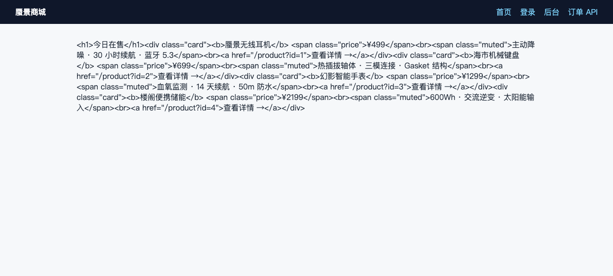
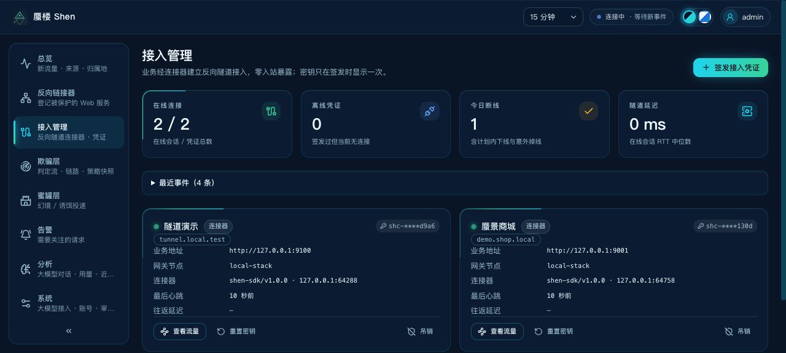
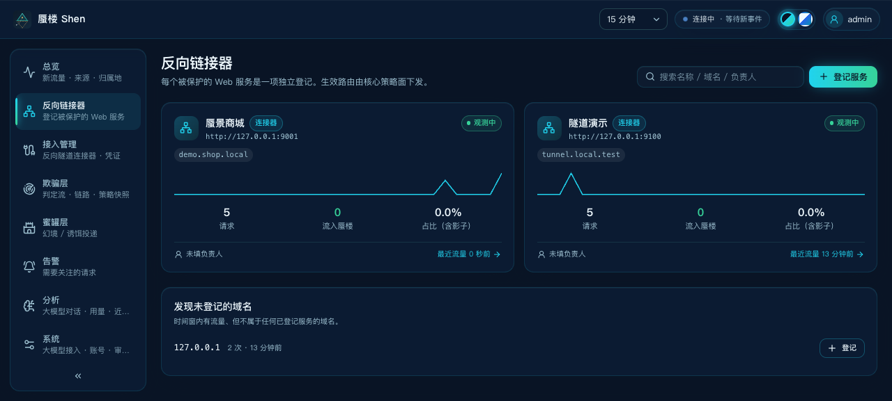
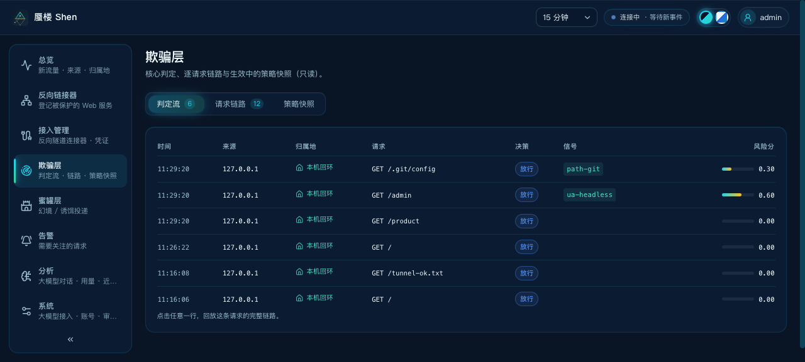

# `demo/` —— 真实业务接入反向链接器 · 完整演示

一个典型的真实业务（**蜃景商城**：商品 / 登录 / 订单 / 后台）如何接入蜃楼的
反向隧道能力：业务**零改造、零入站暴露**，外部流量经连接器隧道进入引擎，
在控制台实时可见、可管理。

 · 

<sub>左：[开发者视角（接入与运行）](../assets/architecture/developer-view.html) —— ②③ 交付与部署、④⑤ 握手与自动登记；右：[流量视角（检测与分流）](../assets/architecture/traffic-view.html) —— 正常流量经隧道回源到后台服务，恶意流量被引进蜜罐。完整调用链 ①→⑩ 见根 README 与下表。</sub>

```
demo/
├── up.sh                  # 一键演示：编译 → 签发凭证 → 起连接器 → 验证接入记录与管理
├── attack.sh              # 恶意流量模拟：七类攻击探针（判定/告警观测）
├── traffic/               # 伪造流量全场景核对（send.py + scenarios.json，从 scripts/traffic 迁入）
├── shop/shop.go           # 业务逻辑（package shop）：商品/登录/订单/后台
├── business/main.go       # 独立业务进程（配合 shen-connector 二进制）
├── connector.env.example  # shen-connector 环境配置模板
└── screenshots/           # 运行效果截图
```

> SDK 进程内接入（方式二）的示例在 [`modules/connector/example/embedded/`](../modules/connector/example/embedded/main.go)
> —— 示例与 SDK 同模块维护（架构规则：demo 不跨顶层依赖产品模块）。

## 一、快速开始（3 条命令）

```sh
# ① 起蜃楼栈（二选一）
scripts/dev.sh up          # 本机直跑（无需 Docker）
docker compose up -d --build           # 容器栈

# ② 跑演示（自动：编译业务 → 登录管控台签发凭证 → 起连接器 → 验证接入记录）
demo/up.sh

# ③ 打开管控台看效果
open http://127.0.0.1:5173/connectors  # 接入管理：demo 业务在线、可管理
```

`demo/up.sh` 是幂等的：重复运行会**重置已有凭证换新 key**（旧 key 即时作废——
这本身就是一次吊销演示）。`demo/up.sh manage` 单独演示管理动作；
`demo/up.sh stop` 停演示进程（不动蜃楼栈）。

## 二、运行效果截图

**真实业务（蜃景商城）**——跑在业务侧本机回环，外部无法直达：



**控制台 · 接入管理**——demo 业务在线：凭证脱敏徽章、业务地址、网关节点、
连接器版本、最后心跳；可吊销 / 重置密钥：



**控制台 · 反向链接器**——demo 服务被**自动登记**（「连接器」来源徽章），
域名归类与流量统计就绪：



**控制台 · 欺骗层**——判定流记录每次访问（含经隧道的攻击探针），点行看链路：



## 三、接入方式与配置项

### 方式一：shen-connector 独立进程（任意技术栈的业务）

```sh
cp demo/connector.env.example demo/connector.env   # 填入签发的凭证
set -a; . demo/connector.env; set +a
shen-connector
```

| 配置项 | 必填 | 说明 |
| --- | --- | --- |
| `SHEN_CONNECTOR_GATEWAY` | ✓ | 网关地址 `host:port`（本地栈 `127.0.0.1:9446`；compose 为 `.env` 的 `SHEN_GATEWAY_PORT`，默认 `:19446`） |
| `SHEN_CONNECTOR_KEY` | ✓ | 接入凭证（`shc-` 开头；控制台「接入管理」签发，明文只显示一次） |
| `SHEN_CONNECTOR_UPSTREAM` | ✓ | 本地真实业务地址（如 `http://127.0.0.1:9001`；业务只听回环即可） |
| `SHEN_CONNECTOR_NAME` | ✓ | 服务名（与凭证签发时一致；连接器不得改名） |
| `SHEN_CONNECTOR_HOSTS` | ✓ | 声明域名（逗号分隔；必须是凭证域名白名单的**子集**） |
| `SHEN_CONNECTOR_TLS_INSECURE` |  | `true` = 跳过证书校验（**仅本地自签**；生产必须删除） |

### 方式二：Go SDK 进程内接入（业务与连接器同进程）

完整可运行示例见 [`modules/connector/example/embedded/`](../modules/connector/example/embedded/main.go)——核心只有一段：

```go
tun, err := connector.Connect(ctx, connector.Config{
    Gateway:  "shen-gw.example.com:9446",
    AuthKey:  os.Getenv("SHEN_CONNECTOR_KEY"),
    Upstream: "http://127.0.0.1:9001",   // 业务照常起在回环
    Name:     "蜃景商城",
    Hosts:    []string{"demo.shop.local"},
})
defer tun.Close() // 断线自动重连直到 ctx 取消
```

## 四、接入步骤详解（up.sh 背后发生了什么）

1. **签发凭证**：管理员在控制台「接入管理」为业务签发凭证——绑定服务名 + 域名白名单，
   明文只显示一次（控制台只落 SHA-256 哈希）。
2. **部署连接器**：业务侧拿到凭证，用二进制或 SDK 向网关**向外拨号**建立 TLS 长连接；
   握手携带服务元数据（名称 / 域名 / 本地业务地址 / 连接器版本）。
3. **自动登记**：网关校验通过后，把服务元数据上报控制台——登记表自动出现该服务
   （来源=连接器），无需手动登记；连接与断开全程审计。
4. **流量上线**：外部用户访问 `业务入口 + Host: demo.shop.local` → 代理按 Host
   命中隧道会话 → 请求字节穿隧道到连接器 → 连接器转发给本机业务 → 原路返回。

### 注意事项

- **业务零入站暴露**：业务只听 `127.0.0.1`；这是零信任的前提，不要为了「方便测试」绑 0.0.0.0。
- **域名白名单是硬边界**：连接器声明的域名超出凭证白名单会被网关直接拒绝。
- **一 key 一服务**：凭证与服务绑定；重置密钥后旧 key 立即作废，存量连接在一个心跳周期（约 15 秒）内被拒。
- **本地自签证书**：`TLS_INSECURE=true` 只限本地开发；生产网关用正规证书，连接器走系统根证书校验。
- **控制台不下发策略**：接入与登记是自动化的，改道 / 拦截决策仍全部由核心策略面决定。

## 五、模块说明与调用关系

### 视角一：真实业务如何接入并运行

[](../assets/architecture/developer-view.html)

<sub>完整调用链 ①→⑩ 见根 README「视角一」的步骤表；编号标在对应连线上。源图 `../assets/architecture/developer-view.html` 自带排版自检（控制台执行 `layoutReport()`）。</sub>

| 模块 | 用处 |
| --- | --- |
| `demo/shop` | 真实业务逻辑（对蜃楼零感知） |
| `modules/connector/sdk` + `cmd/shen-connector` | 业务侧接入：拨号 / 握手 / 断线重连 / 转发到本地业务 |
| `modules/connector/gateway` | 平台侧网关：凭证校验、会话池、回环字节桥、自动登记上报 |
| `modules/console/internal/connector` | 凭证生命周期（签发/吊销/重置）与会话观测 |

### 视角二：流量进入系统后如何欺骗与导流

[](../assets/architecture/traffic-view.html)

<sub>七步处理链与三值分流见根 README「视角二」；源图 `../assets/architecture/traffic-view.html` 自带排版自检。</sub>

- **放行（route_origin）**：命中隧道域名的请求原样穿隧道到真实业务——业务「隐身」在引擎之后；
- **改道（route_mirage）**：可疑请求被引到合成幻境（蜜罐），攻击者在假世界里继续探测，真实业务毫发无伤；
- **拦截（block）**：明确恶意直接 403；
- 每一步都在欺骗层「判定流」实时可见（点行看逐跳链路），蜜罐层的投递结果独立可查。

**一句话**：业务接入时连接器把业务「送进」蜃楼；流量进入时蜃楼决定谁去真实业务（隧道）、
谁去幻境（欺骗）——这就是反向链接器的全部价值。

## 六、为什么自研而不是整体采用开源方案（选型摘要）

| 能力 | frp / rathole / bore | cloudflared | OpenZiti | 蜃楼连接器（自研） |
| --- | --- | --- | --- | --- |
| 反向隧道多业务 Host 路由 | ✓（frp vhost） | ✓（绑定 CF 边缘） | ✓（overlay 服务） | ✓ |
| 认证 | **全局单 token**（frp） | CF 账号体系 | 身份/策略体系（完整但重） | per-service key + hosts 白名单 + 吊销 |
| 与欺骗引擎联动 | ✗ | ✗ | ✗ | ✓（judge/mirage/decoy 同一条请求路径） |
| 管控台联动（自动登记/审计/观测） | ✗（自带简陋 dashboard） | CF 云端 | 自有控制台 | ✓（与蜃楼控制台一体） |
| 集成成本 | 需写胶水且凭证模型不符 | 绑定云厂商 | 引入整个 overlay 栈 | 已交付 |
| 传输层 | yamux/QUIC（成熟） | QUIC（成熟） | 自有协议 | **yamux（直接复用同款开源件）** |

**结论**：隧道**传输层已经站在开源之上**（yamux）；整体替换成 frp/OpenZiti 会失去
凭证作用域、欺骗联动与控制台一体性，收益为负。可吸收的开源演进方向：QUIC 传输
（cloudflared 路线，丢包链路更优，架构已预留——只需替换 yamux 底层）、mTLS 双因子。
