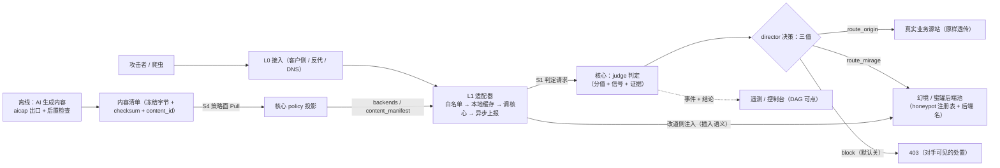
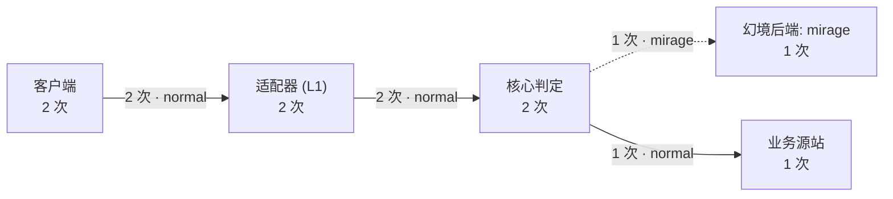
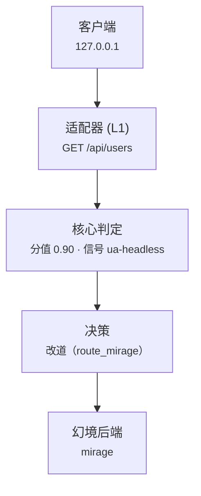
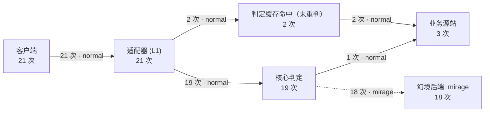
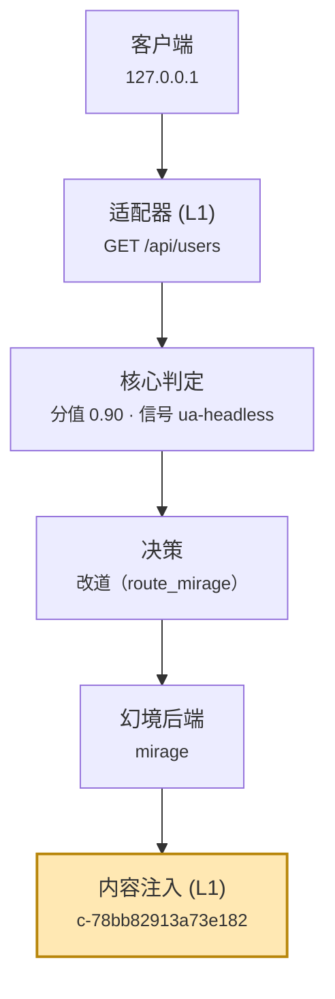
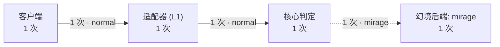
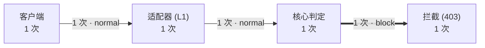
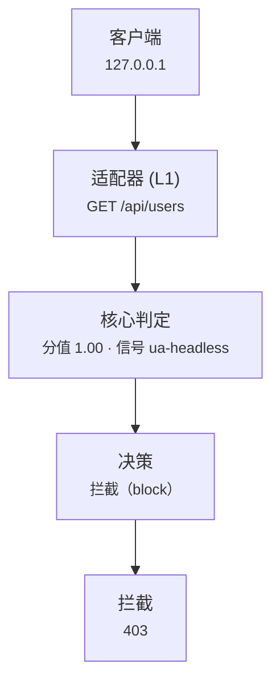

# 欺骗引擎功能验证报告（AI 生成内容注入 · 2026-09-21）

> **这是什么**：一次性**功能验证报告**（快照）。它**不是**规则（规则在 [`../../design/`](../../design/README.md)），
> 也**不是**契约（契约在 [`../../spec/`](../../spec/README.md)）—— 它回答「**这台引擎现在到底能不能干活**」。
> **证据级 A**：本目录同时放着本次运行的**原始数据**（`check-log.txt` · `manifest.ai.json` · `dag/` · `logs/`），
> **报告里的每个数字与每张图都从那些文件读出来**（渲染器见 [`scripts/dev/render-dag.py`](../../../scripts/dev/render-dag.py)）。
> **模型**：DeepSeek（`deepseek-flash`，默认值）；key **只经环境变量 `SHEN_AI_KEY`**，未写入仓库任何文件。
> **本次结论**：**23 项验收全过** ——
> 「判定 → 三值决策 → 诱导到幻境（蜜罐）→ **AI 生成内容注入**」全链路实测生效。

---

## 0. 四个问题，各自的状态

| # | 你的问题 | 结论 | 落在哪 |
| --- | --- | --- | --- |
| 1 | 欺骗层整体功能是否已实现 | ✅ **已实现并本次实测**：判定 · 三值决策 · 改道 · 注入 · 观测 · 秒级关闭 · 拦截 | [`check-log.txt`](check-log.txt)（23 项） |
| 2 | 欺骗注入能力是否生效 | ✅ **实测生效**：改道侧被注入（**插入**语义，幻境正文保留），业务侧**逐字节不变**（`INT-8`） | §2 阶段② |
| 3 | 动态注入 **AI 生成** 的欺骗信息 | ✅ **实测生效**：清单 `generator=model-v1`（16 条 AI 写的内容），注入的字节**逐字节等于清单里那一份**，且**不在模板产物里** | §2 阶段② · §3 |
| 4 | 诱导进场访问蜜罐 | ✅ **实测生效**：幻境后端池 **1 个登记 / 1 个可用**，本阶段 **18 条**判定 `action=route_mirage backend=mirage` | §2 阶段② · §4 |

**一句话**：四个问题的答案都是「是」，而且都有本次运行的原始数据；未实现的部分（诱饵资产通路、真实蜜罐协议栈、内容轮换消费方）在 §5/§6 逐条写明，**没有拿计划当现状**。

---

## 1. 全链路（架构示意 —— 这张是**示意图**，证据图在 §2）



**读法**：判定与决策**只在核心实现一次**（`AR-2` / `MD-12`）；适配器只执行处置；内容**离线**生成、
经**策略面**下发、在改道侧**确定性命中**；响应路径**永不调模型**（`AR-29` / `AR-30`）。

---

## 2. 分阶段图示记录（每阶段：期望 → 实测 → 图 → 原始数据）

> 每个阶段的图都由**该阶段真实运行时**控制台导出的 JSON 渲染：`dag/<阶段>/` + `scripts/dev/render-dag.py`。
> 拓扑图回答「这一阶段流量整体走了哪几条路」，链路图回答「这一条请求每一步发生了什么、为什么」。

### 阶段 ① 关闭态：不注入时，字节与直连完全一致

- **期望**：`ai.enabled=false` + `SHEN_PROXY_INJECT_CONTENT=false` ⇒ 改道侧与业务侧都和「未注入基线」逐字节一致。
- **实测**（引自 [`check-log.txt`](check-log.txt)）：
  - `✓ 改道侧与「未注入基线」逐字节一致：经引擎 9eef5471e0ca88c0 vs 幻境直连 9eef5471e0ca88c0`
  - `✓ 业务侧与业务基线逐字节一致：经引擎 3e535d75f9418bcc vs 业务直连 3e535d75f9418bcc`
  - `✓ 逐请求事件：改道侧上报 inject=disabled：1 条改道侧请求，取值 ['disabled']`
- **说明什么**：**开关真的是开关** —— 默认关时行为与没有这套能力时逐字节相同（不影响原始业务，`NI-1`）。
- 原始数据：[`dag/1-closed/`](dag/1-closed/) · `requests=2 · to_mirage=1 · to_origin=1`

### 阶段：`1-closed`

**① 拓扑（这一阶段流量整体走了哪几条路）**



> 合计：alerts=0 · blocked=0 · fail_open=0 · fallback=0 · high_risk=1 · l4_conclusions=0 · requests=2 · to_mirage=1 · to_origin=1 · unjudged=0（`shadow=False`）

**② 单请求链路（每一步发生了什么）**


> 代表请求：`GET /api/users` · action=**route_mirage** · executed=**mirage** · inject=**disabled** · score=0.9 · backend=mirage · content_id=—


| 步骤 | 这一跳是什么 | 请求 | 响应 | 为什么 |
| --- | --- | --- | --- | --- |
| 1 | 客户端 | GET /api/users（来源 127.0.0.1 · UA HeadlessChrome/120） | —（这是链路的起点，观测由适配器采集） | 请求到达接入层后进入引擎：L0 负责 TLS 与路由，适配器负责观测与处置执行（判定逻辑只在核心，AR-2）。 |
| 2 | 适配器 (L1) | GET /api/users（来源 127.0.0.1 · UA HeadlessChrome/120） | 判定来源：核心判定 | 适配器按顺序做四件事：白名单 → 本地判定缓存 → 调核心判定 → 异步上报（AR-6）；它只执行处置，不做判定（AR-7）。 |
| 3 | 核心判定 | GET /api/users（来源 127.0.0.1 · UA HeadlessChrome/120） | 分值 0.90 · 信号 ua-headless | judge 按配置里的规则逐条匹配（权重求和，1.0 截断）⇒ 分值 0.90，命中 1 条规则（ua-headless）；是否处置由 director 按阈值与灰度决定。 |
| 4 | 决策 | 分值 0.90 · 信号 ua-headless | 改道（route_mirage） | director 输出**三值**（放行 / 改道 / 拦截）+ severity 旁路字段；影子模式下只算不执行（INT-11）——所以下一跳可能仍是业务源站。 |
| 5 | 幻境后端 | GET /api/users（来源 127.0.0.1 · UA HeadlessChrome/120） | 200 · 40 字节 · 1.2ms | 决策为改道 ⇒ 转发到幻境后端 'mirage'（改道后端表由策略面下发，ADR-0018）；注入只发生在改道侧（INT-8：业务侧响应零改写）。 |

### 阶段 ② 打开态：改道 + **AI 生成内容注入**（本轮主角）

- **期望**：核心装载 AI 清单并投影 → 适配器在**改道侧**把内容**插入**响应（幻境正文保留）；
  业务侧不动；同会话同资源三次同答案（`AR-30`）；跨会话落不同变体（多态）。
- **实测**（引自 [`check-log.txt`](check-log.txt)）：
  - `✓ 清单由模型产出（generator=model-v1，不是模板）：generator=model-v1；该资源 8 个 body 由 AI 生成`
  - `✓ 注入的内容体逐字节来自清单（即 AI 生成的那一份）：命中清单 body（1589 字符）`
  - `✓ 注入体**不在**模板产物里（与模板清单直接对比）：模板清单里没有这一段 ✓`
  - `✓ 注入是**插入**：幻境自己的正文仍在：字节 40 → 1629`
  - `✓ 业务侧响应**逐字节不变**（INT-8）：3e535d75f9418bcc == 3e535d75f9418bcc`
  - `✓ 同会话同资源三次 → 响应 sha256 相同：sha256=6298fc08a2eedc10，三次长度 [1488, 1488, 1488]`
  - `✓ 16 个会话落在 ≥4 个不同变体上（多态生效）：命中 8 个变体（N=8）`
  - `✓ 逐请求事件：inject=applied 且带 content_id：20 条，例：c-78bb82913a73e182`
  - `✓ DAG 出现「内容注入」跳且三段文字齐全：内容注入 (L1) ⇒ c-3eb8269e414b773d`
- **说明什么**：**AI 写的内容真的进了对手看到的字节里**，而且**只动改道侧**、**可复现**（会话钉定），
  并且有一条**直接判别**（注入体不在模板产物里）—— 不靠 `generator` 字段这一条间接证据。
- 原始数据：[`dag/2-inject/`](dag/2-inject/) · `requests=21 · to_mirage=18 · to_origin=3 · unjudged=2`

### 阶段：`2-inject`

**① 拓扑（这一阶段流量整体走了哪几条路）**



> 合计：alerts=0 · blocked=0 · fail_open=0 · fallback=0 · high_risk=20 · l4_conclusions=0 · requests=21 · to_mirage=18 · to_origin=3 · unjudged=2（`shadow=False`）

**② 单请求链路（每一步发生了什么）**


> 代表请求：`GET /api/users` · action=**route_mirage** · executed=**mirage** · inject=**applied** · score=0.9 · backend=mirage · content_id=c-78bb82913a73e182


| 步骤 | 这一跳是什么 | 请求 | 响应 | 为什么 |
| --- | --- | --- | --- | --- |
| 1 | 客户端 | GET /api/users（来源 127.0.0.1 · UA HeadlessChrome/120） | —（这是链路的起点，观测由适配器采集） | 请求到达接入层后进入引擎：L0 负责 TLS 与路由，适配器负责观测与处置执行（判定逻辑只在核心，AR-2）。 |
| 2 | 适配器 (L1) | GET /api/users（来源 127.0.0.1 · UA HeadlessChrome/120） | 判定来源：核心判定 | 适配器按顺序做四件事：白名单 → 本地判定缓存 → 调核心判定 → 异步上报（AR-6）；它只执行处置，不做判定（AR-7）。 |
| 3 | 核心判定 | GET /api/users（来源 127.0.0.1 · UA HeadlessChrome/120） | 分值 0.90 · 信号 ua-headless | judge 按配置里的规则逐条匹配（权重求和，1.0 截断）⇒ 分值 0.90，命中 1 条规则（ua-headless）；是否处置由 director 按阈值与灰度决定。 |
| 4 | 决策 | 分值 0.90 · 信号 ua-headless | 改道（route_mirage） | director 输出**三值**（放行 / 改道 / 拦截）+ severity 旁路字段；影子模式下只算不执行（INT-11）——所以下一跳可能仍是业务源站。 |
| 5 | 幻境后端 | GET /api/users（来源 127.0.0.1 · UA HeadlessChrome/120） | 200 · 2717 字节 · 0.2ms | 决策为改道 ⇒ 转发到幻境后端 'mirage'（改道后端表由策略面下发，ADR-0018）；注入只发生在改道侧（INT-8：业务侧响应零改写）。 |
| 6 | 内容注入 (L1) | 幻境响应的 HTML（插入点标记前）：资源 /api/users | 已插入内容 c-78bb82913a73e182（改道侧响应体已改写） | 内容由 ai-capability 离线生成并**强制过护栏**（AR-33：结构 / 黑名单 / 长度 / 风格）→经策略面下发的 content_manifest → 适配器按（资源 + 会话哈希）**确定性命中**变体 → 注入改道侧；业务侧响应字节不变（INT-8），热路径不调模型（AR-30）。 |

### 阶段 ③ 秒级关闭：不重启适配器就能停注入

- **期望**：核心切回 `ai.enabled=false`（**只重启核心**）⇒ 适配器下一个 Pull 周期后不再注入。
- **实测**：
  - `✓ 核心（关闭态 v3）已重启：pid=12777`
  - `✓ 适配器进程未被重启：pid=12773`
  - `✓ 关闭后：响应体里没有清单里的任何内容体：字节 40 到 40`
  - `✓ 关闭后：改道侧响应回到原样（不再注入）：9eef5471e0ca88c0 == 9eef5471e0ca88c0`
- **说明什么**：**能秒级关掉**（三层开关里最外那一层），不需要发布、不需要重启接入层。
- 原始数据：[`dag/3-killed/`](dag/3-killed/) · `requests=1 · to_mirage=1`

### 阶段：`3-killed`

**① 拓扑（这一阶段流量整体走了哪几条路）**



> 合计：alerts=0 · blocked=0 · fail_open=0 · fallback=0 · high_risk=1 · l4_conclusions=0 · requests=1 · to_mirage=1 · to_origin=0 · unjudged=0（`shadow=False`）

**② 单请求链路（每一步发生了什么）**


> 代表请求：`GET /api/users` · action=**route_mirage** · executed=**mirage** · inject=**disabled** · score=0.9 · backend=mirage · content_id=—


| 步骤 | 这一跳是什么 | 请求 | 响应 | 为什么 |
| --- | --- | --- | --- | --- |
| 1 | 客户端 | GET /api/users（来源 127.0.0.1 · UA HeadlessChrome/120） | —（这是链路的起点，观测由适配器采集） | 请求到达接入层后进入引擎：L0 负责 TLS 与路由，适配器负责观测与处置执行（判定逻辑只在核心，AR-2）。 |
| 2 | 适配器 (L1) | GET /api/users（来源 127.0.0.1 · UA HeadlessChrome/120） | 判定来源：核心判定 | 适配器按顺序做四件事：白名单 → 本地判定缓存 → 调核心判定 → 异步上报（AR-6）；它只执行处置，不做判定（AR-7）。 |
| 3 | 核心判定 | GET /api/users（来源 127.0.0.1 · UA HeadlessChrome/120） | 分值 0.90 · 信号 ua-headless | judge 按配置里的规则逐条匹配（权重求和，1.0 截断）⇒ 分值 0.90，命中 1 条规则（ua-headless）；是否处置由 director 按阈值与灰度决定。 |
| 4 | 决策 | 分值 0.90 · 信号 ua-headless | 改道（route_mirage） | director 输出**三值**（放行 / 改道 / 拦截）+ severity 旁路字段；影子模式下只算不执行（INT-11）——所以下一跳可能仍是业务源站。 |
| 5 | 幻境后端 | GET /api/users（来源 127.0.0.1 · UA HeadlessChrome/120） | 200 · 40 字节 · 1.6ms | 决策为改道 ⇒ 转发到幻境后端 'mirage'（改道后端表由策略面下发，ADR-0018）；注入只发生在改道侧（INT-8：业务侧响应零改写）。 |

### 阶段 ④ 拦截：第三值 `block`（默认关，覆盖验证）

- **期望**：拦截默认关（`Q5` · `INT-12` 阶梯放开）；显式打开 `SHEN_BLOCK_ENABLED=true` 且分值过阈值 ⇒ 403。
- **实测**：
  - `✓ 拦截路径：403（对手可见的处置）：status=403 body=b''`
  - `✓ 逐请求事件：executed=block 且 action=block：1 条拦截请求`
  - `✓ 拦截侧不注入（inject=off）：取值 ['off']`
- **说明什么**：三值**都不是纸面值** —— `route_origin` / `route_mirage` / `block` 各自都有实测路径。
- 原始数据：[`dag/4-block/`](dag/4-block/) · `requests=1 · blocked=1`

### 阶段：`4-block`

**① 拓扑（这一阶段流量整体走了哪几条路）**



> 合计：alerts=1 · blocked=1 · fail_open=0 · fallback=0 · high_risk=1 · l4_conclusions=0 · requests=1 · to_mirage=0 · to_origin=0 · unjudged=0（`shadow=False`）

**② 单请求链路（每一步发生了什么）**


> 代表请求：`GET /api/users` · action=**block** · executed=**block** · inject=**off** · score=1 · backend=— · content_id=—


| 步骤 | 这一跳是什么 | 请求 | 响应 | 为什么 |
| --- | --- | --- | --- | --- |
| 1 | 客户端 | GET /api/users（来源 127.0.0.1 · UA HeadlessChrome/120） | —（这是链路的起点，观测由适配器采集） | 请求到达接入层后进入引擎：L0 负责 TLS 与路由，适配器负责观测与处置执行（判定逻辑只在核心，AR-2）。 |
| 2 | 适配器 (L1) | GET /api/users（来源 127.0.0.1 · UA HeadlessChrome/120） | 判定来源：核心判定 | 适配器按顺序做四件事：白名单 → 本地判定缓存 → 调核心判定 → 异步上报（AR-6）；它只执行处置，不做判定（AR-7）。 |
| 3 | 核心判定 | GET /api/users（来源 127.0.0.1 · UA HeadlessChrome/120） | 分值 1.00 · 信号 ua-headless | judge 按配置里的规则逐条匹配（权重求和，1.0 截断）⇒ 分值 1.00，命中 1 条规则（ua-headless）；是否处置由 director 按阈值与灰度决定。 |
| 4 | 决策 | 分值 1.00 · 信号 ua-headless | 拦截（block） | director 输出**三值**（放行 / 改道 / 拦截）+ severity 旁路字段；影子模式下只算不执行（INT-11）——所以下一跳可能仍是业务源站。 |
| 5 | 拦截 | GET /api/users（来源 127.0.0.1 · UA HeadlessChrome/120） | 403 · 0 字节 · 1.0ms | 决策为拦截 ⇒ 返回 403。403 是对手**可见**的处置，属已承认的设计（ADR-0002）：block 只用于「明确拒绝已知恶意」，透明误导由 route_mirage 承担。 |

### 阶段 ⑤（另一种形态）Docker 整栈：三值 + 白名单都在**交付形态**里验过

上面的四个阶段跑在**本地进程栈**（同一份 core/proxy/console 二进制 + 两个仿真站）。这里补上 **Docker 整栈** ——
也就是交付时的那个形态。它有两种配置，**都跑了**：

**（a）默认栈 `make up` = 影子模式 + 0 个后端 ⇒ 只观察不处置**（`INT-11` 要求首次上线必须影子）：

```text
幻境后端池：0 个登记 / 0 个可用（不实现具体蜜罐，ADR-0011）
核心已启动（影子模式（只算判定、不处置，INT-11））：127.0.0.1:9443
```

这一形态验的是**观测路径**（`scripts/shen.sh traffic --check-graph --check-l4`）：

```text
断言 26/27 通过 · 观察 0 条 · 缺口 8 条 · 出口卫生问题 0 条
失败场景：probe-git-normal-ua          ← 规则精度类（`/.git` 前缀匹配只看开头），见 functional-verification §2
链路 70 条；落点取值与每步三段均已核对
```

**（b）接管覆盖 `compose.verify-mirage.yaml`（仓库自带的验证配方）⇒ 真的处置**：

```text
幻境后端池：1 个登记 / 1 个可用（不实现具体蜜罐，ADR-0011）
核心已启动（接管模式（产出真实三值决策））：127.0.0.1:9443
```

发四条请求（同一形态下三种落点 + 一条白名单）：

```text
/healthz → HTTP 200
/.git/config → HTTP 200
/.git/config(sqlmap) → HTTP 403
/ → HTTP 200
```

控制台 DAG（`GET /api/graphs`）与拓扑合计：

```text
  method  path                action        executed     backend   score   status
  GET    /                  route_origin  origin       -         0       200
  GET    /.git/config       block         block        -         1       403
  GET    /.git/config       route_mirage  mirage       mirage    0.9     200
  GET    /healthz           route_origin  origin       -         0       200

  totals = {'requests': 4, 'alerts': 1, 'high_risk': 1, 'unjudged': 0, 'fail_open': 0, 'to_origin': 2, 'to_mirage': 1, 'fallback': 0, 'blocked': 1, 'l4_conclusions': 4}
```

**（c）白名单（`SHEN_VERIFY_WHITELIST`）—— `INT-25` 在交付形态里的实证**：
把来源网段加进白名单后，**同一条**请求（HeadlessChrome + `/.git/config`，在 (b) 里是 `route_mirage`）变成
`executed=whitelist` 且 `unjudged=true`（**没有调核心**）：

```text
  method  path                action   executed     unjudged  score  status
  GET    /.git/config       -        whitelist    True      0      200
  GET    /healthz           -        whitelist    True      0      200

  totals = {'requests': 2, 'alerts': 0, 'high_risk': 0, 'unjudged': 2, 'fail_open': 0, 'to_origin': 2, 'to_mirage': 0, 'fallback': 0, 'blocked': 0, 'l4_conclusions': 0}
```

> 为什么值得单列：白名单是「不影响原始业务」（`NI-1`）的第一道保险 —— 运维探针/健康检查不能被判成攻击者。
> 它在交付形态里真的生效（(c) 的两行），而不只是单测里成立。
> 顺带看到 (b) 的 `l4_conclusions=4`：Docker 形态里 **L4 近线 worker 也在跑**并产出了结论。


---

## 3. 为什么说注入的是「AI 生成」的，而不是模板

模板生成器的产物有**固定指纹**：`<section class="service-detail">` 加 `revision N · variant N · record N`。
本清单里：

| 判据 | 本次（随附 `manifest.ai.json` 实测） |
| --- | --- |
| 清单顶层 `generator` | **`model-v1`** |
| body 条数 | 16（2 个资源 × 8 个变体） |
| 含模板标记 `<section class="service-detail">` 的 body | **0 条** |
| 含模板指纹句式（`revision N · variant N · record N`）的 body | **0 条** |
| 结构去重后的 body 数 | **16**（=16 ⇒ 每条结构都不一样） |
| 验收里那条**直接判别** | 「注入体**不在**模板产物里」（与同一参数生成的模板清单逐字节对比） |

**AI 写的一条正文**（`manifest.ai.json` 的 `/` · variant 0 · checksum `c70ca0f7db765ba8` · 3666 字节；
**示例** —— 注入命中的是清单里的某一份，不一定是这一条）：

```html
<section class="doc-profile" data-profile="site-content" data-variant="0">
  <header class="profile-head">
    <h1>Service registry &amp; status</h1>
    <p class="lede">Service overview for the registered endpoint set. This page lists the current service inventory together with the lifecycle state and observed health state recorded for each entry.</p>
    <dl class="meta-grid">
      <div><dt>Record set</dt><dd>RG-0007</dd></div>
      <div><dt>Revision</dt><dd>rev 14</dd></div>
      <div><dt>Compiled at</dt><dd>2024-11-06T04:20:00Z</dd></div>
      <div><dt>Entries</dt><dd>6</dd></div>
```

> 完整清单：[`manifest.ai.json`](manifest.ai.json)（16 条 body 全文 + checksum + content_id）。

**两个工程细节**（让「AI 生成」不引入新风险）：

1. **身份字段不由模型取**：`resource` / `variant` 决定内容进哪个清单条目，由生成器从输入取 ——
   模型只负责正文（`body`）。模型一次笔误不会把内容挂到错资源上；
2. **生成器标识由代码填、不由模型自评**：候选里的 `generator` 是**我们按实际路径写的**，
   且被闭集守住（只允许 `template-v1` / `model-v1`）—— 所以「这份是 AI 写的」这句话可信。

### 3.1 独立交叉核（换一条证据链，不止信验收脚本自己的断言）

```console
# ① DAG 里被注入的 content_id，是否都能在 AI 清单里找到？
注入用到的不同 content_id: 8 · 不在清单里的: 0
```

> 本次实测：`8` 个注入用到的 `content_id`，**0 个找不到**（都在清单里）。

```console
# ② 清单里的正文有没有模板指纹？（有 ⇒ 说明其实是模板产物）
含模板标记的 body 数 = 0
含模板指纹句式的 body 数 = 0
# 对照（同一条命令**不加** --llm）：generator = template-v1，且**带**模板标记
```

**结论**：注入用的每个 `content_id` 都能在 AI 清单里对上，而 AI 清单里**没有一条**带模板指纹，
再加上验收里那条「注入体不在模板产物里」的直接判别 ——
「AI 生成的内容进了响应」**不是**靠单一脚本的自我声明，而是**三条独立证据**指向同一结论。

---

## 4. 「诱导进场访问蜜罐」是怎么实现的

```text
配置 honeypots[]（类型 + 地址 + enabled）
   → 核心装载：幻境后端池（honeypot 模块：类型注册表 + 后端池解析）
   → 决策 route_mirage + 选定后端名
   → 策略面 Pull 下发 backends（后端表）
   → 适配器转发到该后端（落点 = mirage），失败则回落业务（NI-5）
   → 改道侧再注入 AI 内容（插入语义，不新增替换语义 ST-5）
```

**阶段② 那一次运行的核心日志**（[`logs/core-stage2.log`](logs/core-stage2.log)，每阶段一个文件名，不会串）：

```text
2026/09/22 00:05:34 策略已装载 policy_id=ai-check version=2 checksum=1937f956f5b1f0519f8111f1ebb17f2f00599a5e7e9f79dc1416b52977939fd3 规则=1 条 灰度=100%
2026/09/22 00:05:34 诱饵面：0 个资产启用（observe-only，MD-25）
2026/09/22 00:05:34 幻境后端池：1 个登记 / 1 个可用（不实现具体蜜罐，ADR-0011）
2026/09/22 00:05:34 AI 内容已装载：/var/folders/nq/bmyvmrpj3wz3jzk9g7l43rl00000gn/T/shen-ai-check-501/manifest.json（内容版本 v1 · 变体 8 · 资源 2 · 内容 16 条）
2026/09/22 00:05:34 核心已启动（接管模式（产出真实三值决策））：127.0.0.1:57921
```

> 这一阶段共 **18** 条 `action=route_mirage backend=mirage` 的判定（同一文件里可数）。
> 另外注意第 4 行：**AI 内容已装载（内容版本 v1 · 变体 8 · 资源 2 · 内容 16 条）** —— 核心确实装载了 AI 清单。

**适配器的落点日志**（[`logs/proxy-on.log`](logs/proxy-on.log)；同一路径、不同会话落到不同变体，字节数因此不同）：

```text
proxy: 路由：GET /api/users decision_id=38df77da1bd31b8c21d27f4ee3e6dfd5 判定=route_mirage 落点=mirage（后端 "mirage"）状态=200 字节=1629 耗时=2.6ms
proxy: 路由：GET /api/users decision_id=7b64ae42e0285e8b2cfd96a36ed3f060 判定=route_mirage 落点=mirage（后端 "mirage"）状态=200 字节=1488 耗时=0.5ms
proxy: 路由：GET /api/users decision_id=ed82353c64c34e577fdb761c32bf7100 判定=route_mirage 落点=mirage（后端 "mirage"）状态=200 字节=4739 耗时=0.3ms
```

**诚实边界**：本项目**不实现具体蜜罐**（[`ADR-0011`](../../background/decisions/0011-honeypot-entry-external-backends.md)：
只做入口与后端池，具体蜜罐接第三方）。本次后端是一个「**web-clone 仿真站**」（`type: "web-clone"`，正文只有 40 字节）——
所以这条证明的是「**诱导与改道执行通了**」，**不是**「高交互蜜罐像不像真的」。真实协议栈（SSH / MySQL / …）**未实现**（§5）。

---

## 5. 能力状态总表（含**未实现**的部分）

| 能力 | 状态 | 证据 |
| --- | --- | --- |
| 判定（分值 + 信号 + 证据） | ✅ 本次实测 | 阶段②链路图的「核心判定」跳（分值 0.90 · 信号 ua-headless） |
| 三值决策（放行 / 改道 / 拦截） | ✅ 本次实测三值齐 | 阶段①（origin）· ②（mirage）· ④（block） |
| 改道到幻境（蜜罐）后端 | ✅ 本次实测 | `logs/core-stage2.log`（后端池 1/1 · 18 条 route_mirage） |
| 白名单（`INT-25`）命中即**不调核心** | ✅ 本次实测（Docker 接管形态） | 阶段⑤(c)：同一条请求 → `executed=whitelist` + `unjudged=true`；核心侧另有 `director.whitelisted()` 先于引流判定 |
| 蜜罐后端池解析（类型注册 / enabled / 健康） | ✅ 单测 | `common/core/internal/honeypot`：`TestResolveEnabledHealthy` · `TestResolveUnknownName` · `TestResolveDisabledIsNotResolved` · `TestResolveUnhealthyIsNotResolved` · `TestNewRejectsInvalid` |
| 失败回落真实业务（`NI-5`） | ✅ 有实现与单测 | `make gate`（proxy 单测）· 本次未单独构造 |
| 内容注入（插入语义，只改道侧） | ✅ 本次实测 | 阶段②「注入是插入：字节 40 → …」 |
| **AI 生成内容**（`kind=content` 走模型） | ✅ 本次实测 | 清单 `generator=model-v1` · 注入体逐字节命中清单 · 且不在模板产物里 |
| 后置检查四关（结构/黑名单/长度/风格） | ✅ 本次实测（0 条被拒）+ 负例 | 「清单生成成功 … 拒绝 0 条」+ 关卡用例（注入标识 ⇒ 退出码 1、不写清单） |
| 会话钉定（`AR-30`） | ✅ 本次实测 | 阶段②同会话三次 sha256 相同 |
| 多态（跨会话多变体） | ✅ 本次实测 | 阶段②16 会话命中 8 个变体 |
| 秒级关闭（三层开关） | ✅ 本次实测 | 阶段③（只重启核心） |
| 观测（逐请求 / DAG / 结论事件） | ✅ 本次实测 | 阶段②拓扑与链路图 + `inject=applied` + `content_id` |
| L4 近线分析（意图/链/策略） | ✅ 已实现（默认规则路；`--llm` 走模型） | `make dev` 第 6 段 · [`plans/2026-09-21-l4-model-and-stability.md`](../../plans/2026-09-21-l4-model-and-stability.md) |
| **诱饵资产 → 边缘** | ❌ **未接通** | `logs/core-stage2.log`：「诱饵面：0 个资产启用（observe-only，MD-25）」 |
| **真实蜜罐协议栈**（SSH/MySQL/…） | ❌ **未实现**（只有框架 + 契约） | [`modules/honeypot-protocol.md`](../../modules/honeypot-protocol.md) §8 |
| **内容轮换消费方**（识破信号 → 清单 version+1） | ❌ **未接通** | [`modules/strategy.md`](../../modules/strategy.md) 未决 4 |
| 内容分发分片（>1 MiB 清单） | ❌ 未实现 | [`spec/ai-contract.md`](../../spec/ai-contract.md) §3 |
| 真实存储后端（Redis/PG/CH） | ❌ 未接入（内存实现） | `NI-13` |

---

## 6. 本次**没有**验证的（不要把没做的说成做了）

| # | 没做的 | 为什么 | 它会怎么被验 |
| --- | --- | --- | --- |
| 1 | ~~Docker 全套~~ **已跑**：默认栈（影子）与接管覆盖（真的处置）都跑了；**未跑**的是 `scripts/shen.sh verify` 的完整报告与 `make up` 下的 **AI 注入**（AI 注入只在本地进程栈里验过） | Docker 形态的 AI 注入要额外挂清单与打开注入开关，本轮未做 | `make up` + 挂 `ai.manifest` + `SHEN_PROXY_INJECT_CONTENT=true` |
| 2 | **真实业务站**（本次是 40 字节仿真站） | 保持验证可控、可复现 | 接入演练（[`runbook.md`](../runbook.md) §1） |
| 3 | **真实高交互蜜罐** | 本项目不实现具体蜜罐（`ADR-0011`） | 接第三方后按 [`modules/honeypot.md`](../../modules/honeypot.md) 注册 |
| 4 | **模型 vs 模板的质量对照** | 本次只证明「AI 内容能进链路」，没做质量基准 | 另开一轮（`ADR-0031` 未解决 1，按基准纪律做） |
| 5 | **`block` 的灰度与误伤评估** | 只做了「打开即生效」的覆盖验证 | `INT-12` 阶梯放开时的接入演练 |
| 6 | **多节点 / 跨机**（明文 gRPC 只允许回环） | 本次全在本机 | 跨节点需 mTLS（未实现，见 [`design/structure.md`](../../design/structure.md) §4） |
| 7 | **模型输出的稳定性 / 成本** | 只跑了一轮（16 次调用） | 在真实批次量下观测（`ADR-0031` 未解决 4） |

---

## 7. 怎么复跑（你检查时用）

```sh
# ① key 只经环境变量（不要写进任何文件）
export SHEN_AI_KEY='<你的 deepseek key>'

# ② 一键：AI 生成内容 + 全链路验收 + 拦截覆盖 + 每阶段 DAG 落盘
python3 scripts/dev/ai-inject-check.py --llm --block --keep --dag-out /tmp/dag

# ③ 把 DAG 原始数据渲染成图（本报告的图就是这么来的）
python3 scripts/dev/render-dag.py --dag-dir /tmp/dag

# ④ 不接模型（模板生成器，默认路径；无需 key）
make ai-check
```

`--keep` 保留临时目录（含清单、配置、**每阶段独立的 core 日志**、适配器日志）并打印路径 ——
那里面是本次运行的现场；`docs/ops/ai-injection-2026-09-21/` 是它的快照。

---

## 8. 证据文件清单

| 文件 | 是什么 |
| --- | --- |
| [`check-log.txt`](check-log.txt) | 本次验收的**完整输出**（全过；含每项实测值） |
| [`manifest.ai.json`](manifest.ai.json) | **本次实际下发的 AI 内容清单**（16 条 body · `generator=model-v1` · checksum · content_id） |
| `dag/1-closed/` · `dag/2-inject/` · `dag/3-killed/` · `dag/4-block/` | 四个阶段的控制台原始 JSON（`topology` / `graphs` / `flow` / `analysis`） |
| `logs/core-stage1.log` · `core-stage2.log` · `core-stage3.log` · `core-block.log` | 核心日志（**每阶段一个文件名**：策略装载 · 后端池 · AI 清单装载 · 逐判定） |
| [`logs/proxy-on.log`](logs/proxy-on.log) · [`logs/proxy-off.log`](logs/proxy-off.log) | 适配器日志（逐请求落点 · 注入开关） |
| [`logs/docker-traffic.log`](logs/docker-traffic.log) | **Docker 默认栈（影子模式）**的流量扫描：27 个场景的断言/缺口 + 逐请求链路核对 |
| [`logs/docker-disposal.txt`](logs/docker-disposal.txt) | **Docker 接管形态**的处置实证：改道 / 拦截 / 对照 的 HTTP 码 + DAG + 拓扑合计 + 核心启动日志 |
| [`logs/docker-whitelist.txt`](logs/docker-whitelist.txt) | **Docker 白名单**实证：`executed=whitelist` + `unjudged=true`（`INT-25`） |
| [`logs/docker-stack.txt`](logs/docker-stack.txt) | Docker 默认栈的容器状态与核心启动日志（影子模式 · 后端池 0/0） |

> 复跑与渲染脚本：[`scripts/dev/ai-inject-check.py`](../../../scripts/dev/ai-inject-check.py)（验收）·
> [`scripts/dev/render-dag.py`](../../../scripts/dev/render-dag.py)（图）· [`analysis/aicap/`](../../../analysis/aicap)（生成出口与检查）。
